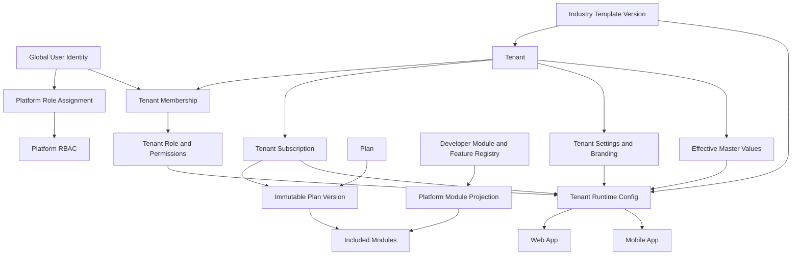
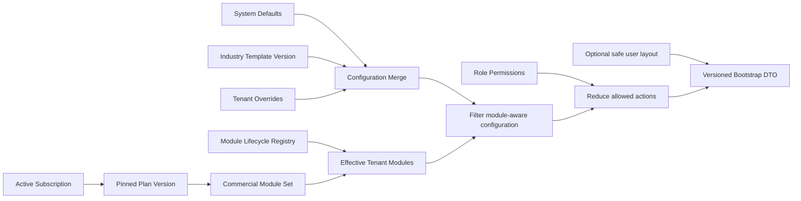
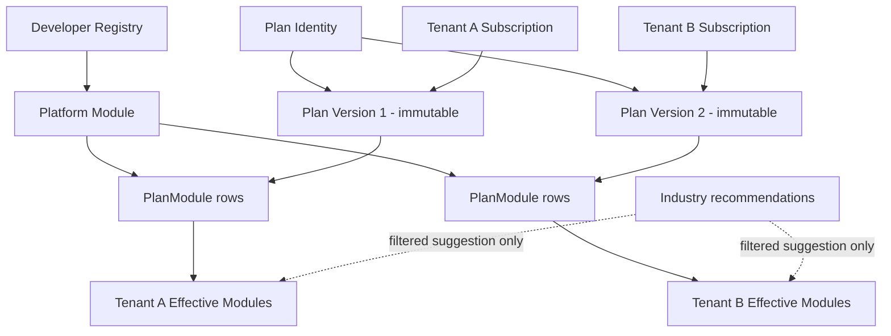
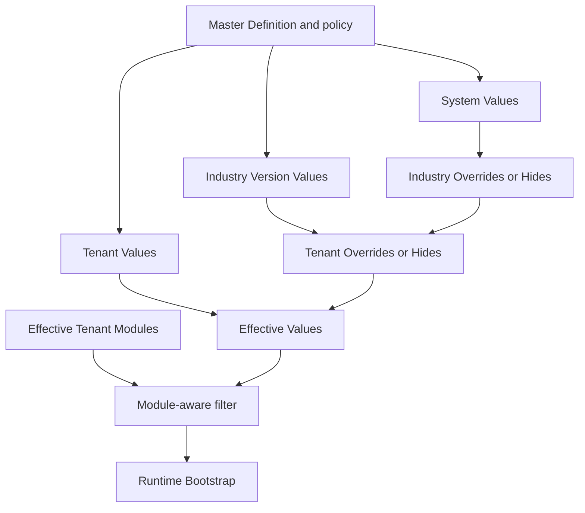

# Phase 0 architecture decisions

Status of all decisions: **Proposed for Phase 0 implementation**, based on repository audit at commit `d6edbce`. They become accepted when the team approves this blueprint and Phase 0 implementation begins.

## Decision log

| ADR     | Decision                                                                                               | Consequence                                                                                         |
| ------- | ------------------------------------------------------------------------------------------------------ | --------------------------------------------------------------------------------------------------- |
| ADR-001 | Modules and Features are developer-registered capabilities.                                            | Runtime DB records are synchronized projections; no arbitrary create API/UI.                        |
| ADR-002 | Plans commercially grant Modules, never individual Features.                                           | Feature metadata cannot become an entitlement engine.                                               |
| ADR-003 | Tenant access to Modules derives from active Subscription -> pinned PlanVersion.                       | Tenant `enabledModuleCodes` is removed or explicitly derived/cache-only.                            |
| ADR-004 | Industry Templates configure/recommend but do not commercially grant Modules.                          | Industry recommendations are intersected with Plan Modules.                                         |
| ADR-005 | Published PlanVersions are immutable.                                                                  | Price, limit, rule, or Module changes publish a new integer version.                                |
| ADR-006 | Existing tenants stay pinned to their PlanVersion until explicit migration/change.                     | No silent commercial changes.                                                                       |
| ADR-007 | One global User identity may have many TenantMemberships and independent platform access.              | Credentials are not duplicated per tenant; employment/access leaves `User`.                         |
| ADR-008 | Platform RBAC and Tenant RBAC are separate scopes.                                                     | Platform roles cannot implicitly act inside tenants; tenant roles cannot manage platform commerce.  |
| ADR-009 | Permission definitions use explicit scope and domain action codes.                                     | `platform.modules.update` and `crm.leads.create` coexist without scope ambiguity.                   |
| ADR-010 | Authenticated membership establishes tenant context.                                                   | Client-provided `tenantId` never authorizes operational access.                                     |
| ADR-011 | Tenant-owned rows include `tenantId` and use a tenant-scoped repository/facade.                        | Query scoping is structural and testable, not developer convention alone.                           |
| ADR-012 | V1 uses shared PostgreSQL with row-level application/service isolation.                                | No database-per-tenant, service mesh, or microservices. Database RLS may be defense in depth later. |
| ADR-013 | The backend remains a NestJS modular monolith.                                                         | Bounded contexts are modules in one deployable system until scale requires otherwise.               |
| ADR-014 | Masters contain simple configurable values only.                                                       | Entities and policies do not enter a generic MasterRecord junk drawer.                              |
| ADR-015 | Master inheritance uses Definition, scoped Value, and Override/Suppression records.                    | Stable codes and provenance survive rename/hide behavior.                                           |
| ADR-016 | SaaS Subscription Plans are not Masters.                                                               | Plans & Pricing is the only platform commercial authority.                                          |
| ADR-017 | Platform SaaS pricing and Tenant product pricing are separate bounded contexts.                        | Platform invoices/plans never reuse Product/SKU/PriceBook tables or permissions.                    |
| ADR-018 | Runtime configuration follows System -> Industry -> Tenant -> Role/Permission -> optional User layout. | One resolver produces deterministic effective configuration.                                        |
| ADR-019 | Commercial Module availability is resolved before role/configuration overlays.                         | No lower-precedence layer can grant an excluded Module.                                             |
| ADR-020 | Prisma Model, API DTO, and frontend View Model are distinct contracts.                                 | APIs return composed, validated DTOs rather than raw rows.                                          |
| ADR-021 | Existing frontend layouts/routes/components are preserved during conversion.                           | Work replaces fixture plumbing through hook/context/service/API layers and adds states/permissions. |
| ADR-022 | Audit events are append-only, scoped, correlated, and redacted.                                        | Sensitive values are never stored; critical events use durable delivery semantics.                  |
| ADR-023 | Files are private objects with MediaAsset ownership metadata.                                          | Access uses authorization and signed URLs; object keys are tenant-prefixed.                         |
| ADR-024 | Asynchronous work starts with PostgreSQL outbox/jobs and an independent worker.                        | Redis remains cache/rate infrastructure until queue throughput justifies BullMQ.                    |
| ADR-025 | Cache is never authority and uses explicit configuration/permission versions.                          | Mutations increment versions and evict keys; sensitive actions revalidate state.                    |
| ADR-026 | Applied Prisma migrations are immutable.                                                               | Tenancy/Foundation changes use forward expand-backfill-verify-contract migrations.                  |
| ADR-027 | Production, development/demo seeds, and test factories are separate.                                   | Fake tenants/users/transactions and shared passwords never populate production by default.          |
| ADR-028 | Monetary values use Decimal and ISO currency.                                                          | Plan/payroll/order calculations define rounding explicitly.                                         |
| ADR-029 | UTC stores instants; IANA timezone/ISO locale/currency define display and business dates.              | Attendance and billing boundaries are deterministic per tenant.                                     |
| ADR-030 | Domain lifecycle changes use services/state policies, not arbitrary status patches.                    | Subscription, provisioning, membership, payroll and workflow invariants are centralized.            |
| ADR-031 | Module lifecycle and Feature implementation maturity are independent.                                  | `ACTIVE` catalog state cannot claim production-ready API/mobile/offline behavior.                   |
| ADR-032 | Platform support access to tenant data is explicit, time-bounded and audited.                          | Email domain or a global super-admin role does not imply tenant impersonation.                      |
| ADR-033 | Tenant list/read/write APIs are paginated and indexed by real access patterns.                         | Scale is practical without speculative infrastructure.                                              |
| ADR-034 | Derived screen concepts remain queries/read models.                                                    | No `HotLead`, `TodayVisit`, `UnassignedLead`, dashboard, ranking, or report tables.                 |

## A. SaaS foundation



## B. Tenant runtime resolution



Precedence for non-commercial configuration is System Default -> Industry Template -> Tenant Override -> Role/Permission -> optional safe User layout. Commercial Modules have a separate authority: PlanVersion Modules -> Subscription -> active Module lifecycle.

## C. Plan to Tenant to Module inheritance



Publishing Version 2 does not move Tenant A. An explicit, audited subscription change is required.

## D. Master inheritance



Stable codes and source rows are preserved. A hide affects new selection, not historical references.

## E. Authentication and tenancy request flow

```mermaid
sequenceDiagram
  participant C as Web or Mobile Client
  participant A as JWT Session Guard
  participant M as Membership Context Guard
  participant P as Permission Guard
  participant S as Tenant-scoped Service
  participant R as Tenant Repository
  participant D as PostgreSQL

  C->>A: Bearer/cookie access token
  A->>A: Verify token and active session
  A->>M: userId plus selected membershipId
  M->>D: Load active membership and tenant state
  D-->>M: tenantId, membership, role versions
  M->>P: RequestPrincipal
  P->>P: Check Module availability and domain permission
  P->>S: Authorized principal
  S->>R: Domain command/query; no client tenantId
  R->>D: WHERE tenantId = principal.tenantId
  D-->>R: Tenant-owned rows only
  R-->>C: Explicit API DTO
```

## Future bounded contexts

```text
Identity & Access
Platform Catalog
Subscription & Billing
Tenant Provisioning
Tenant Configuration
Audit & Compliance
Media
Workforce
CRM
Field Operations
Revenue / Orders
Collections
Service
Communications
Reporting
AI
```

These are module boundaries inside the V1 modular monolith, not deployment boundaries.

## Developer conventions

| Question                        | Convention                                                                                                                                        |
| ------------------------------- | ------------------------------------------------------------------------------------------------------------------------------------------------- |
| Where do I add a Module?        | Add it to `MODULE_REGISTRY`; synchronization projects it to the DB. Do not POST a module.                                                         |
| Where do I add a Feature?       | Add a stable implementation key under its Module in `FEATURE_REGISTRY`, plus implementation evidence. No commercial entitlement row.              |
| Where do I add a Master?        | Add an approved Generic Master definition to the system registry/production seed and its module dependency; policies/entities go to their domain. |
| Where do I add a Tenant entity? | In the owning NestJS bounded context with mandatory tenantId, scoped repository, DTO, permission, audit, migration, and isolation tests.          |
| How do I scope a query?         | Obtain tenant from RequestPrincipal and call the tenant-scoped repository. Never use request body/query tenantId for authorization.               |
| How do I add a permission?      | Add a stable scoped PermissionDefinition in code/seed (`platform.*` or domain action), then grant through the correct scope's role relation.      |
| How do I get runtime config?    | Call the versioned TenantRuntimeConfig endpoint/service; do not recompute precedence in pages.                                                    |
| How do I add async work?        | Write an OutboxEvent in the source transaction and implement an idempotent handler with tenant context and retry policy.                          |
