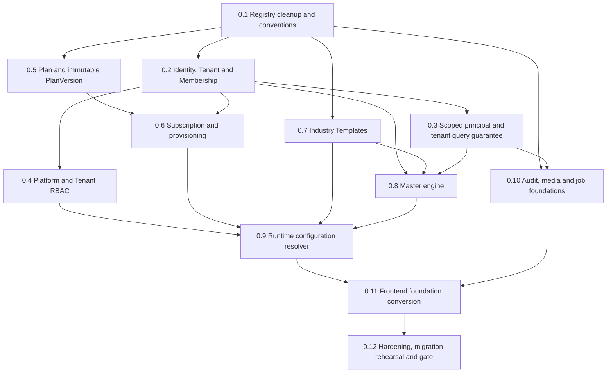

# Phase 0 execution plan

## Delivery rule

Phase 0 builds the SaaS spine only. Leads, Accounts, Visits, Orders, Collections, Telecalling, Service Jobs, WhatsApp, AI, and Reports domain backends remain prohibited until the completion gate passes.

Each step ships as a reviewable vertical foundation slice: forward migration, NestJS service/repository/DTO/guards, tests, and only the minimum frontend replacement needed for the foundation screen. Existing layouts, routes and reusable UI components remain unchanged.

## Dependency graph



## Ordered work packages

| Order | Work package                                | Required output                                                                                                                                   | Priority      | Complexity                                                  |
| ----: | ------------------------------------------- | ------------------------------------------------------------------------------------------------------------------------------------------------- | ------------- | ----------------------------------------------------------- |
|   0.1 | Freeze conventions and clean Module catalog | Approved ADRs; remove create-module contracts; canonical code mapping; registry hash/sync/reconciliation; accurate maturity reporting; seed split | P0 BLOCKER    | Completed                                                   |
|   0.2 | Identity, Tenant and Membership schema      | Tenant aggregate, TenantMembership, PlatformRole, TenantRole, Settings/Branding/Address, atomic foundation transaction, state policies, tests    | P0 BLOCKER    | Completed                                                   |
|   0.3 | Principal and tenant enforcement            | Selected membership flow, RequestPrincipal, membership guard, tenant repository/facade, deny-by-default route policy                              | P0 BLOCKER    | Completed                                                   |
|   0.4 | RBAC scopes                                 | Permission definitions, platform-role grants, tenant-role grants, server-authorized principal/bootstrap; remove frontend mock elevation           | P0 BLOCKER    | L                                                           |
|   0.5 | Plan backend                                | Plan/PlanVersion/Pricing/Limit/Module/CommercialRule models, validation, lifecycle APIs, immutable publish                                        | P0 BLOCKER    | L                                                           |
|   0.6 | Subscription and provisioning               | TenantSubscription, SubscriptionChange, provisioning events/outbox, idempotent create/activate/invite workflow                                    | P0 BLOCKER    | XL - multi-write state machine                              |
|   0.7 | Industry Templates                          | Template/version schema, reviewed seed, recommendations, terminology/config contract, publish lifecycle                                           | P0 FOUNDATION | L                                                           |
|   0.8 | Master engine                               | Definition/value/override schema, 44-category classified migration, effective resolver, module awareness, platform/tenant APIs                    | P0 BLOCKER    | XL                                                          |
|   0.9 | Runtime configuration                       | Versioned bootstrap DTO, precedence, Module resolver, permission and Master output, cache version/invalidation                                    | P0 BLOCKER    | L                                                           |
|  0.10 | Audit, media and jobs                       | Scoped AuditEvent/writer, private MediaAsset metadata/access, outbox/job worker baseline, structured log context                                  | P0 FOUNDATION | L                                                           |
|  0.11 | Convert foundation UIs                      | Modules cleanup; Plans, Tenants, Tenant users/settings/modules, Industries, Masters, platform audit/RBAC data plumbing                            | P0 FOUNDATION | XL - many screens but layouts preserved                     |
|  0.12 | Hardening and gate                          | Migration rehearsal, concurrency/idempotency, tenant isolation, RBAC, resolver, provisioning, contract tests, observability/readiness             | P0 BLOCKER    | L                                                           |

## Work package details

### 0.1 Registry cleanup and conventions

1. Add tests that enumerate 8 Module codes, 35 unique implementation keys, dependencies, and supported lifecycle values.
2. Map obsolete fixture codes: `attendance_plus -> attendance`, `payroll_engine -> payroll`.
3. Remove `legacyCanonicalModules`, module create DTO/API/service/frontend type/action, unused feature-create DTO, and invalid RBAC permission.
4. Define which fields are registry-owned and which safe metadata is admin-editable.
5. Implement an explicit idempotent registry synchronization path with a registry hash/version. Reconcile dependencies and flag removed/drifted records; never claim hard-coded health.
6. Split seed commands into production, development/demo, and test factories. Remove fixed-password production users and password logging.

Exit: a database-only Module cannot be created, and a registry/DB mismatch is observable/tested.

### 0.2 Identity, Tenant and Membership

1. Add Tenant and normalized child settings/branding/address structures.
2. Keep `User` as global credentials; add PlatformRoleAssignment and TenantMembership.
3. Create built-in TenantRole templates and tenant-local role/grant structures.
4. Move `User.role`, `teamId`, manager/dataScope employment meaning behind a compatibility layer into membership-scoped fields. Do not delete legacy fields in the first migration.
5. Provide membership selection rules: single active membership auto-selects; multiple memberships require explicit selection; platform-only users do not acquire a tenant.

Exit: one User can hold two independent active memberships without role/team leakage.

### 0.3 Scoped principal and tenant query guarantee

1. Extend token/session flow with selected membership/session identifiers, not arbitrary tenant IDs.
2. Resolve active User, session, Membership, Tenant status and versioned permissions into RequestPrincipal.
3. Make tenant-domain routes deny by default and require MembershipContextGuard.
4. Introduce tenant-scoped repositories/facade for tenant models and transaction support.
5. Harden the current Shift/Attendance/Payroll routes immediately: add guards and derive actor/member context. Their full domain conversion remains later.
6. Reject cross-tenant IDs in get/update/delete/nested/bulk/export operations.

Exit: adversarial integration tests prove Tenant A cannot read or mutate Tenant B data even with B's UUID.

### 0.4 Platform and Tenant RBAC

1. Define scope-safe permission codes and seed them idempotently.
2. Store platform assignments separately from TenantMembership roles.
3. Remove client mock-principal authorization and email/role heuristics.
4. Cache effective permission sets by assignment/grant version, with immediate invalidation.
5. Design explicit platform support-access grants for tenant troubleshooting.

Exit: UI visibility follows server-issued effective permissions, while APIs independently enforce them.

### 0.5 Plan backend

1. Add Plan identity and draft/published PlanVersion aggregate with integer versions.
2. Normalize query-critical pricing, limit and Module relations; store schema-validated version-snapshot commercial rules as a value object/JSON.
3. Validate currency/billing models, seat/storage limits, trial rules, Module existence/lifecycle and dependency closure.
4. Implement list/detail/create-draft/update-draft/publish/archive/version-history endpoints.
5. Import the four canonical plans only after correcting Module codes and commercial review. Browser-local versions remain demo data and are not imported as history.

Exit: published versions are immutable at service and database levels; existing subscription tests pin versions.

### 0.6 Subscription and provisioning

Status: **COMPLETED / CODE FROZEN (2026-09-07)**. Hardening implementation `f71458a3a22e8cde16121139c018cd0a83e66858` passed [exact-SHA CI](https://github.com/solverixtech-code/Smart-Field-Work-Saas/actions/runs/34104085254). See [implementation and release report](PHASE_0_6_SUBSCRIPTION_PROVISIONING_IMPLEMENTATION.md) and [PR #1](https://github.com/solverixtech-code/Smart-Field-Work-Saas/pull/1). Production legacy-Tenant mappings remain an explicit deployment gate, not a code-freeze blocker. Phase 0.1–0.6 remain frozen; the user has now authorized Phase 0.7 only.

1. Implement Subscription state policy and explicit version changes.
2. Provision Tenant, owner User/Membership, Industry assignment and Subscription core records transactionally.
3. Emit provisioning events/outbox work for email, workspace defaults and cache warmup using idempotency keys.
4. Support retry/resume without duplicate tenant, membership, invite or subscription.
5. Make suspension/grace/cancellation behavior explicit in runtime resolver and API guards.

Exit: repeated identical provision commands converge on one valid tenant and a complete event history.

### 0.7 Industry Templates

Status: **IN PROGRESS / NOT FROZEN**. PRE-PHASE-0.7 baseline is `dfafcb928ad6c907d54508953b703bef504d4ddb`, with green [baseline CI](https://github.com/solverixtech-code/Smart-Field-Work-Saas/actions/runs/34105107769). Lifecycle, exact-version assignment, draft import and reconciliation backend are implemented; final validation and the nonempty terminology/Master-default contract remain release gates. See the [25-entry fixture review](PHASE_0_7_INDUSTRY_FIXTURE_REVIEW.md) and [implementation report](PHASE_0_7_INDUSTRY_TEMPLATES_IMPLEMENTATION.md). Phase 0.8 and 0.9 remain unauthorized.

1. Add stable IndustryTemplate and immutable IndustryTemplateVersion.
2. Model terminology, Master defaults and Module recommendations first; defer complex forms/workflows until real consumers exist.
3. Review the 25 fixture entries and map obsolete Module codes.
4. Add publish and explicit tenant-template migration behavior.

Exit: changing a template does not silently change pinned tenants, and recommendations never grant Modules.

### 0.8 Master engine

1. Implement MasterDefinition, MasterValue and MasterValueOverride with database scope checks.
2. Seed only the approved 24 Generic Master definitions/system values.
3. Remove Subscription Plan and Shift duplicates; keep Domain/Policy rows in fixtures until owning contexts exist, clearly non-authoritative.
4. Implement effective-value resolution and hide/rename rules with provenance.
5. Preserve `/admin/masters` UI and add `/platform/configuration/masters` management semantics.

Exit: every one of the 44 categories is either served by its correct authority or deliberately unavailable pending its owning domain; none is silently forced into generic storage.

### 0.9 Runtime configuration resolver

1. Implement Module resolution from active Subscription and pinned PlanVersion.
2. Merge System, Industry and Tenant settings; filter module-aware Masters; then reduce actions by permissions.
3. Return a schema-versioned web/mobile bootstrap DTO and config version.
4. Cache by tenant/membership/config version; implement transactional invalidation events.
5. Define behavior for trial, past due, grace, suspended and cancelled states.

Exit: the same inputs always produce the same bootstrap, and invalidation tests prevent stale entitlements.

### 0.10 Audit, media, jobs and observability

1. Evolve AuditLog forward into scoped, correlated, redacted AuditEvent behavior.
2. Add tenant/request/actor context to structured logs and metrics; never log tokens, OTPs, passwords or provider secrets.
3. Add MediaAsset and private signed access; validate S3 configuration and readiness.
4. Add PostgreSQL outbox/job worker with idempotency, retries and dead-letter visibility.
5. Instrument API latency, resolver cache, provisioning steps, job failures and tenant-denied access.

Exit: critical provisioning/commercial/security events are queryable and failed async work is visible/retryable.

### 0.11 Frontend foundation conversion

Preserve Page -> Hook/Context -> Service Interface -> API Service. Convert in this order:

1. Modules: cleanup developer ownership/maturity display.
2. Plans list/create/details/version history.
3. Tenants list/create/details, membership, settings and effective Modules.
4. Industries management.
5. Platform/Tenant RBAC management.
6. Masters platform definitions and tenant effective values.
7. Audit logs and runtime bootstrap consumption.

Every conversion includes loading, error, empty, validation-conflict, permission-denied and stale-version states. No page imports Prisma types or calls Axios directly.

### 0.12 Gate and migration rehearsal

1. Run all unit/integration/API tests against PostgreSQL, not mocked tenant filters.
2. Rehearse expand/backfill/verify/contract migrations on a production-shaped snapshot.
3. Verify indexes/query plans for membership, subscription, resolver, Master and audit paths.
4. Exercise two-tenant browser/API scenarios and multi-membership switching.
5. Validate frontend foundation flows in a browser at desktop/mobile breakpoints; build success is not visual QA.
6. Produce a release checklist, rollback/forward-fix strategy and known-risk sign-off.

## Migration order

Never edit the four existing migrations.

| Migration | Change                                                                                     | Safety approach                                                 |
| --------: | ------------------------------------------------------------------------------------------ | --------------------------------------------------------------- |
|        M1 | Add Tenant, memberships, scoped RBAC, settings/branding, platform assignments              | Additive; no legacy column removal                              |
|        M2 | Add nullable tenant/membership relations to current operational models and AuditLog        | Additive indexes initially; no NOT NULL yet                     |
|        M3 | Create bootstrap Tenant and map current single-workspace users/data                        | Explicit migration command/report; abort on ambiguous ownership |
|        M4 | Verify/backfill then add tenant-aware unique constraints and required relations            | Database validation queries before constraint                   |
|        M5 | Add Plan/PlanVersion children                                                              | Import only reviewed canonical plans                            |
|        M6 | Add Subscription/changes/provisioning events and pin existing tenant                       | One explicit version; validate Module codes                     |
|        M7 | Add Industry Templates/versions/assignment                                                 | Reviewed seed, explicit assignment                              |
|        M8 | Add Master Definition/Value/Override                                                       | Seed A-class rows only; check scope constraints                 |
|        M9 | Add runtime version, MediaAsset, Outbox/Job and expanded Audit fields                      | Additive; backfill audit scope where knowable                   |
|       M10 | Contract legacy role/team/data-scope and MasterRecord fields only after all consumers move | Separate release; retain export/reconciliation                  |

Migration commands must be repeatable in staging, emit counts/checksums, and fail rather than guess a tenant or PlanVersion.

## Test strategy

### Service unit tests

- Plan publish validation/immutability/dependency closure.
- Subscription state transitions and effective timing.
- Configuration precedence and Master override/hide rules.
- Permission scope and role grants.
- Provisioning idempotency and retry state.
- Audit redaction, cache versioning, media ownership and job backoff.

### PostgreSQL integration/API tests

- Tenant A cannot list/get/update/delete/bulk/export Tenant B rows, including known UUIDs and nested references.
- Platform-only user cannot use tenant routes without support grant; tenant user cannot use platform routes.
- Suspended membership/tenant and expired/grace subscription behavior.
- One User in two Tenants receives independent roles/settings/Masters.
- Compound/partial unique constraints and same-code-in-different-tenant behavior.
- Published PlanVersion cannot mutate; existing tenant remains pinned.
- Industry recommendations are intersected with Plan Modules.
- Outbox and provisioning retries do not duplicate side effects.

### Frontend tests

- Loading, error, empty, permission denied and stale/conflict states.
- Effective Module navigation, plan module display, subscription state and Master provenance/overrides.
- Tenant switch clears tenant-specific query caches.
- Critical provisioning/publish workflows and unsaved draft recovery.
- Use incumbent test tooling; do not add a second framework without justification.

## Phase 0 completion gate

Core CRM implementation cannot start until all boxes are true:

- [ ] Tenant model and lifecycle exist.
- [ ] User supports many TenantMemberships.
- [ ] Platform access and Tenant roles are separate.
- [ ] RequestPrincipal and membership-derived tenant context exist.
- [ ] Tenant-scoped repository/query guarantee is enforced.
- [ ] Cross-tenant tests pass for all existing operational APIs.
- [ ] Current Shift/Attendance/Payroll controllers enforce tenant/domain permissions and no longer authorize a target from a body `userId`.
- [ ] Plan backend and immutable PlanVersion publish exist.
- [ ] TenantSubscription pins a PlanVersion and has tested lifecycle transitions.
- [ ] Effective Module resolution works without editable tenant Module authority.
- [ ] Industry Templates cannot grant commercial access.
- [ ] All 44 Master categories have an implemented authority or explicit deferred owner.
- [ ] Generic Master inheritance/override foundation works.
- [ ] Runtime bootstrap contract, cache version and invalidation work.
- [ ] Platform/Tenant permission namespaces and enforcement are tested.
- [ ] Audit, structured request context, media ownership and durable async foundation exist.
- [ ] Production/dev/test seeds are separated and contain no shared production password.
- [ ] Foundation frontend screens use APIs with loading/error/empty/permission states.
- [ ] Migration rehearsal, build, lint, unit and integration suites pass.
- [ ] Feature catalog no longer overclaims verified maturity.

## Recommended domain sequence after Phase 0

1. Core CRM foundation: Account, Contact, Lead and activity timeline.
2. Pipeline, assignment, Tasks and Follow-ups.
3. Territory entity and assignments.
4. Field Visits, geofence check-in, proof and GPS exceptions.
5. Today Plan, Beat/PJP and route read models.
6. Telecalling and Demos.
7. Product, SKU, PriceBook, tax and Orders.
8. Collections and dealer ledger.
9. Workforce hardening: leave/holiday/attendance precedence and shifts.
10. Payroll/incentive/reimbursement hardening.
11. Service Jobs.
12. Communications: WhatsApp, notifications, email/SMS provider delivery.
13. Performance and Reporting projections.
14. Local Business/Google profile integrations.
15. AI features after reliable source data and evaluation criteria exist.

Accounts/Contacts are included in the first Core CRM slice because Lead screens already compose those concepts; Visit work follows them because Visits reference both account/contact and executive membership.

## Recommended next implementation prompt

```text
Implement Smart Field Work Phase 0 work package 0.1 only: Module registry
authority cleanup and seed separation, following the approved files in
docs/architecture.

Scope:
- preserve existing Module catalog screens and API reads/updates that remain valid
- remove database-created Module capability paths and platform.modules.create
- remove legacyCanonicalModules and obsolete attendance_plus/payroll_engine codes
- implement explicit idempotent registry synchronization with registry hash,
  dependency reconciliation, drift reporting, and accurate health/maturity output
- split production registry/default seed from development demo users/data
- add focused unit tests for 8 Modules, 35 implementation keys, uniqueness,
  dependency acyclicity, reconciliation, and removed/drifted entries

Do not add Tenant, Plan, CRM, Visit, Order, WhatsApp, AI, or Report domain models
in this work package. Do not edit existing migrations. Run API tests, lint and
build; report any environment-only verification gaps separately.
```
