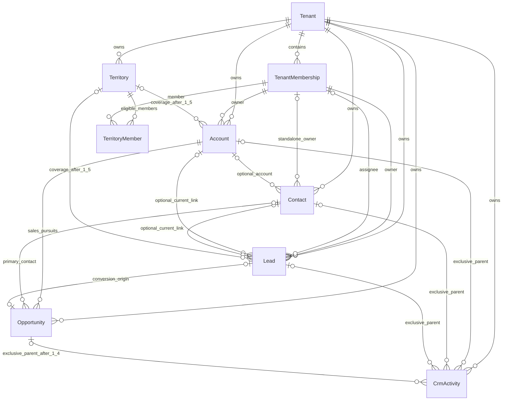

# Phase 1 Core CRM domain and first-slice contracts

Baseline: `bd32a6ed055cb4f4e2a487870d03b148e8b0ffaf`. Status: **proposed for owner architecture review**. This document specifies future work; no model, endpoint, permission, or migration below is implemented by Phase 1.0. [Execution plan](PHASE_1_EXECUTION_PLAN.md) contains source evidence, route inventory, dependencies, and release gates.

## 1. Boundaries and relationship decisions

Keep the existing NestJS modular monolith and PostgreSQL database. Introduce feature-scoped CRM services/repositories, not separate microservices or another persistence framework.

| Aggregate       | Proposed responsibility and invariants                                                                                                                                                                                                                                                                                    |
| --------------- | ------------------------------------------------------------------------------------------------------------------------------------------------------------------------------------------------------------------------------------------------------------------------------------------------------------------------- |
| Account         | Organization/business/customer organization. Keep the visible Business wording and existing `/admin/businesses` routes. An Account is not the SaaS Tenant, TenantSubscription, or a new duplicate Business table. It can exist without a Lead or Contact.                                                                 |
| Contact         | Person, optionally linked to one Account. Standalone contacts support the individual-lead capture path. No separate first/last names until a requirement needs them: the actual UI uses one name. An account-linked Contact inherits record access from its Account; a standalone Contact has its own owner membership.   |
| Lead            | Independent prospect/inquiry, with optional current Account and Contact links. Raw captured names/contact details are prospect data, not automatically synchronized copies of Account/Contact. Multiple inquiries may relate to one Account or Contact.                                                                   |
| Conversion      | One atomic command creates or links an Account and/or Contact, validates their relationship, records immutable target references and conversion actor/time, and transitions the Lead. Individual leads may convert to a standalone Contact. No automatic Account deduplication by name.                                   |
| Opportunity     | Sales pursuit with amount/currency and a domain-owned pipeline stage. Distinct from Lead lifecycle and Account status. Proposed initial business-deal requirement: Account required; primary Contact optional and must belong to that Account. Individual-only opportunities require a product decision before Phase 1.4. |
| Activity / Note | Product record of a note or manually recorded interaction. Separate from security/platform audit. Initially one explicit Account, Contact, or Lead parent; exactly one non-null parent FK. Add Opportunity parent in 1.4. No unconstrained `entityType + entityId` polymorphic reference.                                 |
| Assignment      | Owner is accountable membership; assignee is optional working membership, introduced with Lead and later routing. Account initially uses one owner because the UI exposes one assigned executive. Automated routing changes assignments through the same command used by manual assignment.                               |
| Territory       | Tenant-owned coverage configuration and membership links. Postal areas/boundaries do not confer access by themselves. No Team replacement, visits, location tracking, targets, or collections engine inside Territory.                                                                                                    |

Every future CRM domain table, including relationship/history/command tables, requires explicit tenantId/Tenant relation, tenant-aware keys/indexes, createdAt/updatedAt, and trusted actor provenance where appropriate. Mutable records carry revision; immutable history retains timestamps without permitting edits. All arrows between tenant-owned records require matching tenant keys. Lead current links are mutable before conversion; `convertedAccountId`, `convertedContactId`, `convertedOpportunityId`, `convertedAt`, and `convertedByMembershipId` describe history and are immutable after conversion. Several Leads can convert into the same existing Account/Contact. The diagram's one-to-one conversion origin applies only to an Opportunity created by conversion.

### Lead lifecycle and conversion sequence

Proposed lifecycle: `OPEN -> QUALIFIED -> CONVERTED`, with explicit `DISQUALIFIED` and `DUPLICATE` closure commands and a separately authorized reopen policy to be settled in 1.2. Fixture labels such as Hot, Follow-up, Unassigned, Demo Completed, Won / Converted mix priority, scheduling, assignment, qualification, and deal outcome; do not copy them into one enum. Preserve display labels only through an approved mapping. Conversion is not proof that a deal was won or paid.

1. Authenticate and resolve selected membership; check tenant permissions, record scope, subscription/module access, and input schema.
2. Begin one transaction; lock the tenant-scoped Lead and check `expectedRevision`. Recheck all targets within the transaction and access scope. Do not call an unlocked `findFirst` a record lock.
3. Resolve exactly one create/link choice for each requested target. Existing Contact and Account must agree on `Contact.accountId`; never silently reparent an existing person. Individual mode requires a Contact and permits no Account; business mode requires an Account, with Contact optional only if product approval permits it.
4. Create records through the Account/Contact services' transaction-aware internals. The caller must possess the respective create/view permissions and scope; conversion permission is not a bypass.
5. In 1.2, conversion supports Account/Contact only. Reject an Opportunity option as unsupported. In 1.4, add optional Opportunity creation to the SAME transaction. A Lead converted earlier may have a later independently created Opportunity related to it; never rewrite old conversion references to imply it was created during conversion.
6. Atomically compare-and-update the Lead revision and conversion references. Persist tenant-scoped conversion command key/hash/result, unique per tenant/Lead/key. Reuse the existing payload-hash/idempotency pattern; do not overload SubscriptionChange with CRM data.
7. Write registered audit events in the same transaction; from 1.3 onward write the product activity there too. Roll back targets, command result, Lead, and audit together on failure.
8. Concurrent first conversions create at most one result. Same key and same payload replays the stored result only after current authorization succeeds; same key/different payload or another conversion command after conversion returns `409`. Stale unconverted revision returns `409 CRM_STALE_REVISION`. No retry can expose another tenant's result.

The 1.2 migration enforces conversion field consistency and post-conversion immutability in the database as well as the service. Reuse forward-only SQL constraint/trigger conventions without editing frozen triggers. Lock targets in stable order, use bounded retry only for recognized deadlock/serialization errors, and test the loser transaction leaves no orphan targets.

## 2. Proposed Phase 1.1 fields

Only Account and Contact tables are needed for the first slice. IDs follow existing Prisma `String @id @default(uuid())` storage conventions; do not convert existing text identifiers to a different database type. Columns below are proposals tied to existing UI or explicit integrity requirements.

### Account

| Field                                                                        | Shape / justification                                                                                                                                                                                                                                                     |
| ---------------------------------------------------------------------------- | ------------------------------------------------------------------------------------------------------------------------------------------------------------------------------------------------------------------------------------------------------------------------- |
| `id`, `tenantId`                                                             | Server UUID identifier, required Tenant relation.                                                                                                                                                                                                                         |
| `name`                                                                       | Required trimmed 1..200 characters; Business name form/list. One name initially; legal/display split has no proven requirement.                                                                                                                                           |
| `businessTypeValueId`                                                        | Optional FK to effective `business_type` MasterValue; actual form/list business type. New values must be selectable for this tenant.                                                                                                                                      |
| `sourceValueId`                                                              | Optional effective `lead_source` MasterValue; existing Business source filter.                                                                                                                                                                                            |
| `categoryLabel`                                                              | Optional trimmed 1..200 descriptive text for the existing Category / Industry field. Proposed interim domain metadata, not entitlement or a new Master definition. Owner must approve free text versus deferring the field; a managed category directory is not included. |
| `status`                                                                     | Domain state `ACTIVE`, `INACTIVE`, `BLOCKED`; actual Business filters. Defaults ACTIVE. Deletion is separate `deletedAt`, not another status value.                                                                                                                       |
| `ownerMembershipId`                                                          | Required active same-tenant membership; initially defaults to actor. Maps the single assigned executive display. Changing owner requires explicit assign permission.                                                                                                      |
| `addressLine1`, `addressLine2`, `city`, `state`, `postalCode`, `countryCode` | Nullable bounded scalar location fields from AddBusinessPage. No AccountAddress table for a single address. Bounds: address lines 200 each, city/state 100 each, postalCode 20, ISO-style uppercase countryCode length 2. No invented Mumbai/default address.             |
| `website`, `gstin`, `establishedYear`, `description`                         | Nullable: HTTP(S) URL <=2048; uppercase GSTIN exactly 15 alphanumeric characters when supplied (format only, no external verification); year integer 1800..current year; plain description <=2000. These are visible form fields; no billing behavior.                    |
| `revision`                                                                   | Positive integer starting 1; compare-and-update for every mutation. Matches Phase 0 revision terminology.                                                                                                                                                                 |
| `createdAt`, `updatedAt`, `deletedAt`                                        | Server timestamps; deletedAt nullable.                                                                                                                                                                                                                                    |
| `createdByMembershipId`, `updatedByMembershipId`                             | Required trusted actor provenance with same-tenant composite membership FK. Soft deletion retains actor/history.                                                                                                                                                          |

No Phase 1.1 Account phone/email duplication: the current list projects its primary Contact. No external reference without a real integration/idempotent import requirement. No speculative custom-field/EAV tables, tax billing engine, logos/attachments, turnover bands, languages, tags, working-hour schedules, territory/team columns, computed KPI columns, or fabricated revenue. Each deferred visible input must be unavailable with clear wording when the screen converts; no success notification for discarded values. Owner review must accept this first-slice boundary before implementation.

### Contact

| Field                                | Shape / justification                                                                                                                                                                                                                                                                                                   |
| ------------------------------------ | ----------------------------------------------------------------------------------------------------------------------------------------------------------------------------------------------------------------------------------------------------------------------------------------------------------------------- |
| `id`, `tenantId`                     | UUID and required Tenant relation.                                                                                                                                                                                                                                                                                      |
| `accountId`                          | Nullable; same-tenant composite FK. At most one Account. Account link fixed after create in 1.1; attach/detach/reparent requires a later explicit command and product approval.                                                                                                                                         |
| `name`                               | Required trimmed 1..200; actual contact name.                                                                                                                                                                                                                                                                           |
| `phone`, `email`                     | Nullable individually; require at least one on create. Phone accepts normalized international `+` and 7..15 digits; email <=254 with syntax validation and a separate normalized search representation if needed. Existing AddBusiness flow submits a phone; individual Contact can use email only. No synthetic email. |
| `roleValueId`                        | Optional effective `contact_role` MasterValue; role is a business contact label, never RBAC.                                                                                                                                                                                                                            |
| `status`                             | Domain `ACTIVE`, `INACTIVE`, `BLOCKED`, default ACTIVE.                                                                                                                                                                                                                                                                 |
| `ownerMembershipId`                  | Required for standalone Contact (defaults actor), null when Account-linked; linked Contact access follows Account owner. This avoids a second conflicting owner on the same account contact.                                                                                                                            |
| `isPrimary`                          | Boolean, default false; allowed only for active, undeleted, Account-linked Contact. Account creation may include one primary contact atomically.                                                                                                                                                                        |
| `revision`, timestamps, actor fields | Same revision/provenance/deletedAt rules as Account.                                                                                                                                                                                                                                                                    |

Optional alternate/landline/preferred-channel/time inputs are deferred until their ownership and persistence are approved; do not create redundant contact columns just because the prototype offers them. Contact role and designation are not simultaneously stored as interchangeable labels.

### Primary contact, deletion, and duplicate contracts

- At most one active primary Contact per Account, enforced by a partial unique index on `(tenantId, accountId)` where `isPrimary = true AND deletedAt IS NULL`; a check requires non-null account and ACTIVE status for primary rows. An Account may have zero contacts/primary contacts.
- Account contact membership/primary mutations serialize on the tenant-scoped Account row. Switch primary in one transaction: check Account expected revision, validate target, demote old, promote target, increment affected Contact revisions and Account revision, and audit. No transient duplicate primary survives.
- Updating a linked Contact takes the Account lock then Contact lock and increments its own revision; changes affecting the projected primary contact also increment Account revision. General Contact PATCH excludes `isPrimary` and `accountId`.
- Soft delete only. DELETE Account returns `409 CRM_ACCOUNT_HAS_CONTACTS` while undeleted Contacts remain; future Lead/Opportunity references also block deletion according to their slice's reviewed rule. No cascade deletion. Deleting/deactivating a primary Contact returns `409 CRM_PRIMARY_CONTACT_REQUIRED_CHANGE`; first clear/switch primary using the command. Repeated DELETE with a now-invisible ID returns `404`.
- Reuse active/inactive/blocked labels. ACTIVE may move to INACTIVE or BLOCKED; either may return to ACTIVE through an authorized update. A deleted record cannot be edited or selected. BLOCKED is a CRM selection/lifecycle restriction, not a SaaS subscription state. No 1.1 restore endpoint.
- Names, phone, and email are NOT globally unique and are not automatically merged. Shared reception numbers and duplicate names are legitimate. Phase 1.1 permits duplicates; durable lead/import deduplication requires a separately approved key in 1.2/1.7. No blind unique GSTIN constraint without agreement about branches and legal entities.
- Contact account association and standalone ownership constraint: `(accountId IS NOT NULL AND ownerMembershipId IS NULL) OR (accountId IS NULL AND ownerMembershipId IS NOT NULL)`. Cross-tenant composite FKs protect account and actor/owner membership links. Preserve historical membership rows using Restrict; suspension does not rewrite provenance.

## 3. Phase 1.1 API contracts

Proposed routes use `/tenant/crm`, following `/tenant/masters` and tenant runtime services. `main.ts` has no `/api/v1` global prefix. These endpoints do not exist yet. DTO names below are planned API-owned contracts; web types are separate transport types and do not import Prisma.

### Shared validation and list contract

- All routes: `TenantAuthorized()`, `@RequirePermissions(...)`, `TenantScopeFactory.fromPrincipal`, explicit CRM record policy against `principal.tenantPermissions`, and `readEffectiveModules(tx, tenantId, clock, write)` requiring `core_crm`. Every lookup, count, and projection uses the same scope.
- Every path ID must be UUID. Strict DTO allowlists reject `tenantId`, actor IDs, unknown keys, relation graphs, and arbitrary query expressions. No spreading browser bodies into Prisma input.
- `AccountListQuery`: `page` default 1 (1..100000), `limit` default 25 (1..100), `search` trimmed <=200, optional `status`, `businessTypeValueId`, `sourceValueId`, `city` <=100, `ownerMembershipId`; `sortBy` in `name|createdAt|updatedAt`, default createdAt; `sortDirection` asc/desc, default desc. `ContactListQuery` substitutes `accountId`, `roleValueId`, `status`, `ownerMembershipId` for account filters. IDs are filters, never authority. Unsupported filters/sorts return 400.
- Reuse/extend `masterPage` for common query validation. CRM must not inherit `cursorWindow`'s seven-day default or 31-day maximum date window. Reject `(page-1)*limit > 100000` with 400; large extraction uses the later bounded export contract. No unlimited `limit=0`.
- Response: `{items, total, page, limit, totalPages}` from one consistent read snapshot, explicit selects, stable sort plus id tie-breaker. Page past end: empty items with scoped total. Account search: name, city, and primary contact name/phone only when Contact view permission and scope allow that contact; otherwise contact fields do not participate in search/counts. Contact search: name, phone, email. Case-insensitive text search and normalized phone matching; no database regex supplied by user.
- Detail/create/update return explicit `AccountDto` or `ContactDto`, matching the fields above with ISO timestamps, effective label projections, and minimal owner `{id, displayName}`. Account DTO may include one primary Contact summary, never unbounded Contacts. Contact PII and even the primary summary require `crm.contacts.view` plus applicable Contact scope; otherwise omit them. Separate endpoint for the bounded Contact list.
- Phase 1.1 creates are transactional but do not promise automatic retry idempotency. Disable duplicate submission; on an ambiguous timeout reload/search before explicit retry. Durable command keys are introduced for conversion/import where needed, not a speculative generic idempotency platform.

### Endpoint matrix

All GETs return 200; POST create returns 201; PATCH/primary command return 200; successful DELETE returns 204. All inherit 400/401/403/404/429/5xx handling below. `B` denotes `crm.businesses`, `C` denotes `crm.contacts`; these expand to literal permission codes, not new aliases in code.

| Method and path                                         | Permission                                                                            | Request / validation                                                                                                                                                | Pagination, search, sorting                                                            | Concurrency and specific errors                                                                                                                                                        |
| ------------------------------------------------------- | ------------------------------------------------------------------------------------- | ------------------------------------------------------------------------------------------------------------------------------------------------------------------- | -------------------------------------------------------------------------------------- | -------------------------------------------------------------------------------------------------------------------------------------------------------------------------------------- |
| GET `/tenant/crm/accounts`                              | B.view                                                                                | AccountListQuery                                                                                                                                                    | Shared Account list                                                                    | None; invalid query 400                                                                                                                                                                |
| GET `/tenant/crm/accounts/:accountId`                   | B.view                                                                                | UUID; scope, undeleted                                                                                                                                              | None                                                                                   | 404 for absent/out-of-scope                                                                                                                                                            |
| POST `/tenant/crm/accounts`                             | B.create; additionally C.create for nested contact and B.assign for a different owner | CreateAccountDto: Account writable fields plus optional `primaryContact` create payload (no accountId/owner/isPrimary); validate effective Masters and active owner | None                                                                                   | Transaction creates Account, optional Contact, audits; invalid references 404, unavailable same-tenant choice 422                                                                      |
| PATCH `/tenant/crm/accounts/:accountId`                 | B.update; additionally B.assign for owner change                                      | UpdateAccountDto: nonempty subset of writable Account fields plus `expectedRevision` positive integer; excludes primaryContact and server fields                    | None                                                                                   | Compare revision; 409 stale/state; validate owner/Masters again                                                                                                                        |
| DELETE `/tenant/crm/accounts/:accountId`                | B.delete                                                                              | DeleteAccountDto: body `expectedRevision`; UUID                                                                                                                     | None                                                                                   | Soft delete; 409 stale or live references                                                                                                                                              |
| GET `/tenant/crm/contacts`                              | C.view                                                                                | ContactListQuery; linked rows also need visible Account                                                                                                             | Shared Contact list                                                                    | None; filters cannot expand scope                                                                                                                                                      |
| GET `/tenant/crm/contacts/:contactId`                   | C.view                                                                                | UUID; standalone or Account-derived policy                                                                                                                          | None                                                                                   | 404 absent/out-of-scope                                                                                                                                                                |
| GET `/tenant/crm/accounts/:accountId/contacts`          | B.view AND C.view                                                                     | Account UUID plus ContactListQuery excluding accountId                                                                                                              | Same pagination/search/sort; fixed parent AND tenant AND child policy                  | 404 unavailable parent; zero children is empty 200                                                                                                                                     |
| POST `/tenant/crm/contacts`                             | C.create; B.update for a supplied accountId; C.assign for different standalone owner  | CreateContactDto; accountId optional; linked account must be active and writable; standalone owner defaults actor                                                   | None                                                                                   | Account lock for linked create; 404 foreign/out-of-scope parent/owner; 422 inactive selection                                                                                          |
| POST `/tenant/crm/accounts/:accountId/contacts`         | B.update AND C.create                                                                 | Same Contact create fields, without accountId/owner; force parent from scoped URL                                                                                   | None                                                                                   | Account lock; no arbitrary parent in body                                                                                                                                              |
| PATCH `/tenant/crm/contacts/:contactId`                 | C.update; B.update for linked row; C.assign for standalone owner change               | UpdateContactDto: nonempty writable subset + expectedRevision; excludes accountId/isPrimary/server fields                                                           | None                                                                                   | 409 stale or primary deactivation; 404 missing/foreign refs; 422 unavailable role                                                                                                      |
| DELETE `/tenant/crm/contacts/:contactId`                | C.delete; B.update for linked row                                                     | DeleteContactDto: expectedRevision                                                                                                                                  | None                                                                                   | Soft delete; 409 stale/primary; Account lock when linked                                                                                                                               |
| PATCH `/tenant/crm/accounts/:accountId/primary-contact` | B.update AND C.update                                                                 | SetPrimaryContactDto: `contactId` UUID or null, `expectedRevision` of Account                                                                                       | None                                                                                   | Validates target child belongs to exact Account/tenant and is writable; returns `{account, changedContacts}` (at most 2); 409 stale, 404 foreign/mismatched child, 422 inactive target |
| GET `/tenant/crm/owner-options`                         | B.assign OR C.assign (explicit service OR check, not two decorators requiring both)   | page/limit/search; only active same-tenant memberships                                                                                                              | Default 25/max100, displayName+id order, bounded minimal `{id,displayName}` projection | No arbitrary tenant/team; 403 if neither grant                                                                                                                                         |

Master choices reuse existing tenant Master endpoints and their permissions. Phase 1.1 must prove pagination/response shape parity at the service adapter; the existing web master service's array/label assumptions must not be copied as if they were the backend `{items,...}`/name contract. A narrow additive adapter or transaction-aware Master validation seam is allowed only when reviewed and tested; no Master behavior changes.

### Error and concurrency semantics

| HTTP status | Contract                                                                                                                                                                                           |
| ----------- | -------------------------------------------------------------------------------------------------------------------------------------------------------------------------------------------------- |
| 400         | Malformed UUID/query/body, missing/invalid expectedRevision, unknown keys; reuse Zod/class-validator handling.                                                                                     |
| 401         | Expired/revoked auth, stale `ctxv`, mismatching selected membership claim; frozen RequestPrincipalService behavior. Stale membership token is distinct from JWT expiry.                            |
| 403         | No selected active membership, suspended tenant/membership, denied permission/scope request, or missing module/subscription write entitlement. Platform role alone confers no CRM access.          |
| 404         | Well-formed record/reference outside tenant or permitted record scope, deleted row, nested parent mismatch. Never disclose whether Tenant B owns the UUID.                                         |
| 409         | `CRM_STALE_REVISION`, forbidden current-state mutation, primary/child constraint conflict; later conversion/idempotency conflicts.                                                                 |
| 412         | No first-slice endpoint emits it: the repository has revision/409 precedent and no established If-Match/412 CRM contract. The frontend error boundary handles it defensively as a reload conflict. |
| 422         | Well-shaped request with an accessible but inactive/hidden/wrong-definition Master or ineligible active-state domain selection. Do not change the global validation filter from 400.               |
| 429         | Existing throttler; retain Retry-After when supplied; do not automatically retry a mutation.                                                                                                       |
| 5xx         | Explicit failure, request/correlation diagnostic reference where available; no SQL, tokens, or PII in errors; no fixtures.                                                                         |

Use existing Nest error envelopes. New CRM exceptions may add a stable `code` and field details; do not globally wrap legacy responses. Stale detection is an atomic update predicate including `id`, `tenantId`, record policy, `deletedAt: null`, and `revision: expectedRevision`, with increment in the same write. On zero matches, scope-check in the transaction to distinguish 404 from 409 without leaking records. Read-before-write alone is insufficient. Frontend retains user input, fetches current revision, and requires an explicit resubmission after conflict.

## 4. Database introduction and invariant tests

1. Forward-only migration creates Account/Contact with explicit Tenant and membership relations, timestamps, revisions, soft-delete provenance and nullable optional metadata. Historical Phase 0 rows require no backfill: these are empty new tables. Do not import fixture IDs or fake contacts.
2. New tables expose unique `(id, tenantId)` keys; Contact.accountId and all membership references use `(foreignId, tenantId)` composite relations with Restrict. The existing TenantMembership key already supports this; do not alter its legacy team/dataScope semantics.
3. Add primary partial uniqueness/checks and Contact ownership checks in the new SQL migration. Restrict negative/zero revision. Prevent tenantId changes in service and a CRM-table integrity trigger; no transfer between tenants. Relation checks must work for direct SQL as well as HTTP.
4. Index Account `(tenantId, deletedAt, createdAt, id)` for lists and `(tenantId, ownerMembershipId, deletedAt)` for scoped queries. Index Contact `(tenantId, accountId, deletedAt, createdAt, id)` for nested lists and `(tenantId, ownerMembershipId, deletedAt)` for standalone ownership. Add status/type/search indexes only when representative EXPLAIN measurements justify them. No speculative FTS infrastructure.
5. MasterValue is the shared SYSTEM/INDUSTRY/TENANT foundation; blindly composing `(valueId, tenantId)` would reject legitimate shared values. Use normal value FK plus a CRM reference integrity check for the expected definition and allowed source/tenant. Validate current effective selectability in the service transaction with the existing resolver. Historical references remain readable when a value is hidden or an industry version changes. A different tenant's TENANT value is never allowed. Document/test any narrowly required transaction seam in EffectiveMasterService; do not duplicate layering logic.
6. Register permissions and audit events in existing registries, synchronize idempotently, verify both new-tenant role templates and already provisioned tenant roles. No widening of frozen grants except explicitly reviewed additive CRM grants. Client generation/type checks precede API and web conversion.
7. Rehearse fresh database and exact Phase 0 upgrade with representative historical tenant data; compare all 33 historical migration hashes. A later optional column becoming required needs an explicit nullable-add/backfill/verify/constrain sequence. Roll back application exposure on failure; use a forward fix, never reset a shared database or edit migration history.

## 5. Audit and async integration

`AuditEventWriter` / `auditEvents.write(tx, ...)` persists to **AuditLog**, not a separate Prisma AuditEvent model. Register CRM actions in its closed catalog before emitting them; existing lowercase dotted Master/Subscription events establish the convention. Proposed 1.1 category `CRM`: `account.created`, `account.updated`, `account.deleted`, `account.owner.changed`, `account.primary_contact.changed`, `contact.created`, `contact.updated`, `contact.deleted`, `contact.owner.changed`. Later add `lead.created`, `lead.updated`, `lead.converted`, `lead.assigned`, `activity.created`, `opportunity.stage.changed`, and territory/routing commands with their slices.

Use scope TENANT with trusted user/membership and same transaction. Payload allowlist: entity IDs, changed field names, revision before/after, status, owner/primary reference IDs. Do not copy names, phone/email, addresses, GSTIN, note bodies, imported rows, or signed URLs into audit. The existing redactor guards secrets and has 32 KiB, 2,000-node, depth-8 and 2,000-character-string bounds; it is not automatic CRM PII classification. Product notes are stored only as scoped product data, never recovered by exposing AuditLog.

Phase 1.1 adds no jobs or media schema. `JobService` and `JobWorkerService` currently handle only `media.delete-object`. Later imports/exports require explicit registered payload schemas, handlers, limits, retry/idempotency, and tests; there is no existing generic CRM importer to invoke. Reuse lease fencing and the worker's UTC clock semantics. Job payload tenant must originate from validated scope and match job tenant; reauthorize initiating membership, module, action, and record scope at execution and download. Permission revocation or tenant switch must not expose an old export. Add CRM-scoped attachment/result authorization before enabling MediaAsset downloads; a tenant-wide media permission alone is insufficient for restricted CRM records.
