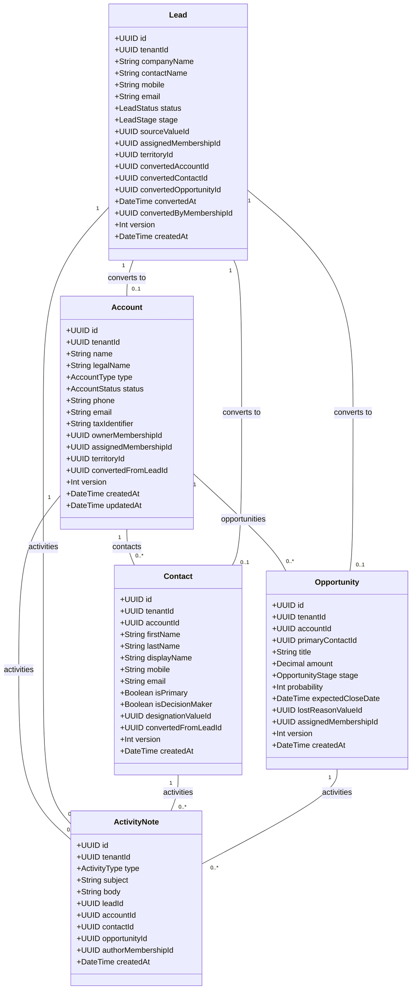

# Core CRM Domain Model & Technical Specification

**Repository**: `solverixtech-code/Smart-Field-Work-Saas`  
**Phase**: Phase 1.0 — Architecture & Domain Specification  
**Document Status**: ARCHITECTURAL SPECIFICATION  

---

## 1. Domain Entities & Aggregate Boundaries



---

## 2. Lead Conversion Lifecycle & State Machine

### 2.1 Lead State Transitions
A Lead in the Smart Field Work SaaS platform moves through a controlled lifecycle:

```
[ NEW ] ──> [ CONTACTED ] ──> [ QUALIFIED ] ──> [ CONVERTED ] (Atomic Conversion)
   │               │                 │
   └──> [ UNQUALIFIED / LOST ] <─────┘
```

- **NEW**: Inbound inquiry or freshly added prospecting lead.
- **CONTACTED**: Initial phone, email, or field contact established.
- **QUALIFIED**: Prospect meets budget, authority, need, and timeline criteria.
- **CONVERTED**: Terminal success state. Lead is converted into Account, Contact, and optional Opportunity.
- **UNQUALIFIED / LOST**: Terminal rejection state. Requires a valid `LostReason` master value.

### 2.2 Atomic Conversion Transaction Algorithm
When converting a lead (`POST /api/v1/crm/leads/:id/convert`), the service executes an **atomic database transaction** (`prisma.$transaction`):

1. **Lock Lead Record**:
   - Query Lead with `where: { tenantId: principal.tenantId, id: leadId }`.
   - Assert `Lead.status !== 'CONVERTED'` (otherwise throw `400 Bad Request`).
2. **Create or Link Account**:
   - If `request.accountId` is supplied, verify Account exists within `principal.tenantId`.
   - If `request.createAccount` is true, create `Account` record using Lead's company name, phone, email, territory, and assigned membership.
3. **Create Contact**:
   - Create `Contact` record linked to the target `Account` (or orphan contact if no account), setting `isPrimary: true`, using Lead's contact name, mobile, email.
4. **Create Optional Opportunity**:
   - If `request.createOpportunity` is true, create `Opportunity` record linked to the target Account and new Contact, setting title, deal amount, and initial pipeline stage (`PROSPECTING`).
5. **Update Lead Record (Immutable Transition)**:
   - Set `status = 'CONVERTED'`, `stage = 'WON'`.
   - Set `convertedAccountId = account.id`.
   - Set `convertedContactId = contact.id`.
   - Set `convertedOpportunityId = opportunity?.id ?? null`.
   - Set `convertedAt = new Date()`.
   - Set `convertedByMembershipId = principal.membershipId`.
   - Increment `version = version + 1`.
6. **Log Activity & Audit Events**:
   - Write `ActivityNote` record of type `STAGE_CHANGE` recording conversion.
   - Write `AuditEvent` of code `lead.converted` via `AuditEventWriter`.

---

## 3. Data Scope Query Algebra

To ensure multi-tenant data access compliance across all repositories, data fetching logic must encapsulate `RequestPrincipal` scopes:

```typescript
import { Prisma } from '@prisma/client';
import { RequestPrincipal } from '../security/request-principal.interface';

export enum DataScope {
  ALL = 'ALL',
  ASSIGNED_CITY = 'ASSIGNED_CITY',
  ASSIGNED_TEAM = 'ASSIGNED_TEAM',
  SELF_AND_ASSIGNED_LEADS = 'SELF_AND_ASSIGNED_LEADS',
}

export interface ScopeFields {
  ownerField?: string;
  assigneeField?: string;
}

export function applyDataScopeFilter<T extends Prisma.AccountWhereInput | Prisma.LeadWhereInput | Prisma.OpportunityWhereInput>(
  principal: RequestPrincipal,
  baseFilter: T,
  fields: ScopeFields = { ownerField: 'ownerMembershipId', assigneeField: 'assignedMembershipId' }
): T {
  const { tenantId, membershipId, dataScope } = principal;
  if (!tenantId) {
    throw new Error('TENANT_CONTEXT_REQUIRED');
  }

  const tenantClause = { tenantId };
  const ownerKey = fields.ownerField || 'ownerMembershipId';
  const assigneeKey = fields.assigneeField || 'assignedMembershipId';

  switch (dataScope) {
    case DataScope.SELF_AND_ASSIGNED_LEADS:
      return {
        ...baseFilter,
        ...tenantClause,
        OR: [
          { [ownerKey]: membershipId },
          { [assigneeKey]: membershipId },
        ],
      } as T;

    case DataScope.ALL:
    default:
      return {
        ...baseFilter,
        ...tenantClause,
      } as T;
  }
}
```

---

## 4. CRM Audit Event Catalog

Core CRM mutations must emit structured compliance events via `AuditEventWriter`:

| Event Code | Event Category | Triggering Operation | Redacted / Monitored Fields |
|---|---|---|---|
| `account.created` | `CRM` | `POST /api/v1/crm/accounts` | Name, Type, Owner Membership ID |
| `account.updated` | `CRM` | `PUT /api/v1/crm/accounts/:id` | Changed fields (beforeJson, afterJson) |
| `account.deleted` | `CRM` | `DELETE /api/v1/crm/accounts/:id` | Account ID, Name |
| `contact.created` | `CRM` | `POST /api/v1/crm/accounts/:id/contacts` | Name, Mobile (partially redacted), Account ID |
| `contact.updated` | `CRM` | `PUT /api/v1/crm/contacts/:id` | Changed contact fields |
| `lead.created` | `CRM` | `POST /api/v1/crm/leads` | Company, Contact, Mobile, Source |
| `lead.updated` | `CRM` | `PUT /api/v1/crm/leads/:id` | Changed lead fields |
| `lead.assigned` | `CRM` | `POST /api/v1/crm/leads/assign` | Previous Assignee, New Assignee, Lead IDs |
| `lead.converted` | `CRM` | `POST /api/v1/crm/leads/:id/convert` | Lead ID, Account ID, Contact ID, Opportunity ID |
| `opportunity.created` | `CRM` | `POST /api/v1/crm/opportunities` | Account ID, Amount, Stage |
| `opportunity.stage_changed` | `CRM` | `PATCH /api/v1/crm/opportunities/:id/stage` | Old Stage, New Stage, Amount |

---

**DOCUMENT STATUS**: `CORE CRM DOMAIN MODEL SPECIFICATION COMPLETED`  
**VERDICT**: `READY FOR INTEGRATION`
