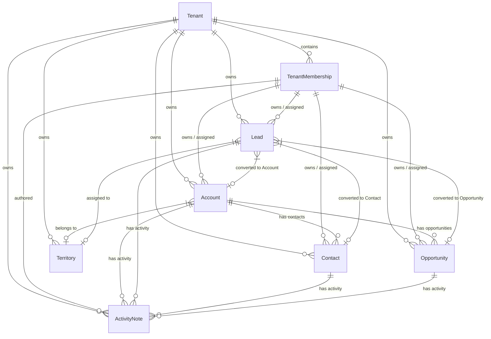
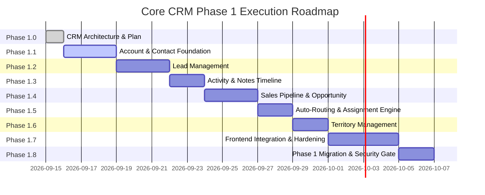

# Phase 1 — Core CRM Architecture & Execution Plan

**Repository**: `solverixtech-code/Smart-Field-Work-Saas`  
**Phase**: Phase 1.0 — Core CRM Architecture & Execution Plan  
**Frozen Baseline SHA**: `bd32a6ed055cb4f4e2a487870d03b148e8b0ffaf`  
**Status**: APPROVED & FROZEN BASELINE VERIFIED  

---

## Executive Summary

Phase 1 establishes the production **Core CRM Subsystem** for the Visiblo Smart Field Work SaaS platform. Phase 0 established the authoritative foundation for Multi-Tenant Security, Membership Context, RBAC Enforcement, Commercial Plan Engines, Industry Templates, Master Data Governance, Audit Event Logging, Media Storage, and Background Job Outbox processing.

Phase 1.0 performs the repository audit, defines aggregate domain boundaries, establishes the Master vs. Domain ownership matrix, designs tenancy/ownership scoping, plans the API & migration contracts, details the Phase 1.1 Account & Contact foundation, and sets the 8-stage work package sequence to convert frontend CRM prototypes into enterprise production micro-services.

---

## 1. Current-State Repository & CRM Audit

### 1.1 Registered Core CRM Feature Inventory Audit
The repository catalog currently registers 7 core CRM features across UI prototypes and static fixtures:

| Feature # | Feature Name | Current Status | UI Screens / Components | Fixture / Static Data Source |
|---|---|---|---|---|
| **1** | **Lead Management** | UI Prototype | `AllLeadsPage`, `AddLeadPage`, `EditLeadPage`, `LeadDetailsPage`, `BulkAssignLeadsPage`, `LeadImportPage`, `LeadExportPage` | `leadsData.ts` |
| **2** | **Business Management** | UI Prototype | `AllBusinessesPage`, `AddBusinessPage`, `BusinessDetailsPage`, `BusinessContactsPage`, `BusinessGoogleProfilePage`, `BusinessSalesHistoryPage`, `BusinessSubscriptionPage` | `businessesData.ts` |
| **3** | **Sales Pipeline** | UI Prototype | `SalesPipelinePage`, `SalesStageViewPage` | `salesPipelineData.ts` |
| **4** | **Auto-Routing & Lead Assignment** | Catalog / UI Only | `BulkAssignLeadsPage`, `AllLeadsPage` (Assign Modal) | `leadsData.ts` |
| **5** | **Territory Management** | UI Prototype | `TerritoriesListPage`, `CreateTerritoryPage`, `EditTerritoryPage`, `TerritoryDetailsPage`, `AssignExecutivesPage`, `TerritoryBusinessesPage`, `TerritoryPerformancePage`, `TerritoryMapPage` | `territoriesData.ts` |
| **6** | **Account & Contact Management** | UI Prototype | `BusinessDetailsPage`, `BusinessContactsPage`, `ConvertedCustomersPage`, `CustomerDetailsPage` | `businessesData.ts`, `customersData.ts` |
| **7** | **Activity Log & Notes** | UI Prototype | `LeadDetailsPage` (Timeline Tab), `BusinessDetailsPage` (Activity Feed), `FollowUpDetailsPage` | `leadsData.ts`, `followupsData.ts`, `demosData.ts` |

### 1.2 Phase 0 Infrastructure Reuse Analysis
Core CRM backend services will directly leverage Phase 0 core abstractions without modification or duplication:

1. **Authentication & Membership Authority**:
   - `RequestPrincipal` (`req.principal`): Provides `tenantId`, `membershipId`, `tenantPermissions`, `dataScope`, and `permissionVersion`.
   - `MembershipContextGuard`: Enforces active tenant membership context on all `/api/v1/crm/*` endpoints. Returns `403 Forbidden` if `tenantId` or `membershipId` is missing.
2. **RBAC Permission System**:
   - `PermissionsGuard` & `@RequirePermission(...)`: Enforces fine-grained permission checks against `RequestPrincipal.tenantPermissions`.
   - `syncRbac`: Seeding script populating `Permission` and `RolePermission` tables.
3. **Audit Event Logging**:
   - `AuditEventWriter`: Enforces security/compliance audit writes for CRM mutations (`account.created`, `account.updated`, `contact.created`, `lead.created`, `lead.converted`, etc.).
4. **Master Data Engine**:
   - `MasterDefinition` & `MasterValue`: Provides configurable workspace categories (e.g., Lead Sources, Industry Sectors, Business Categories, Lost Reasons).
5. **Media Storage**:
   - `MediaAsset`: Handles document attachments, avatars, and business upload assets.
6. **Durable Outbox & Jobs**:
   - `BackgroundJob` outbox: Async processing for bulk lead imports, auto-routing execution, and export generation.

---

## 2. Screen-to-Domain Conversion Matrix

The following matrix maps every existing CRM frontend screen to its production domain aggregate, API endpoints, permissions, filters, and data conversions:

| Screen Name & Path | Route | Fixture Source | Target Domain Aggregate | Required Permission | Actions / Operations | Key Filters & Search | Conversion & Scoping Strategy |
|---|---|---|---|---|---|---|---|
| **All Leads**<br>`/admin/leads` | `/admin/leads` | `leadsData.ts` | `Lead` | `crm.lead.read` | View, Filter, Search, Bulk Assign, Export | Status, Stage, Source, Assigned Executive, Date Range, Search Query | Query scoped by `RequestPrincipal.dataScope` (`OWN`, `ASSIGNED`, `TEAM`, `TENANT`). Replace fixture with `api.crm.leads.list()`. |
| **Add Lead**<br>`/admin/leads/create` | `/admin/leads/create` | `leadsData.ts` | `Lead` | `crm.lead.create` | Create Lead, Attach Business/Contact, Set Status | N/A | Validates mandatory phone/email, deduplicates against existing Accounts/Contacts, writes audit event `lead.created`. |
| **Lead Details**<br>`/admin/leads/:leadId` | `/admin/leads/:leadId` | `leadsData.ts` | `Lead`, `ActivityNote` | `crm.lead.read` | View Tabs (Timeline, Visits, Demos, Follow-ups, Payments), Add Note, Convert Lead | Tab filtering | Fetches Lead aggregate with Timeline activities. Conversion button invokes `POST /api/v1/crm/leads/:id/convert`. |
| **Edit Lead**<br>`/admin/leads/:leadId/edit` | `/admin/leads/:leadId/edit` | `leadsData.ts` | `Lead` | `crm.lead.update` | Update Details, Change Stage, Update Contact Info | N/A | Optimistic concurrency check (`If-Match` / `revision`). Emits `lead.updated` audit event. |
| **Bulk Assign Leads**<br>`/admin/leads/bulk-assign` | `/admin/leads/bulk-assign` | `leadsData.ts` | `Lead`, `LeadAssignmentLog` | `crm.lead.assign` | Bulk Select, Reassign Owner/Executive, Trigger Auto-Routing | Territory, Source, Unassigned filter | Executes bulk update in single transaction or BackgroundJob. |
| **Lead Import**<br>`/admin/leads/import` | `/admin/leads/import` | `leadsData.ts` | `Lead`, `BackgroundJob` | `crm.lead.create` | CSV Upload, Field Mapping, Validation, Import Execution | N/A | Dispatches `BackgroundJob` of type `CRM_LEAD_BULK_IMPORT`. No browser blocking. |
| **Lead Export**<br>`/admin/leads/export` | `/admin/leads/export` | `leadsData.ts` | `Lead`, `BackgroundJob` | `crm.lead.read` | Filter Selection, Format Pick (CSV/XLSX), Export Request | Full search filters | Dispatches `BackgroundJob` for stream export, returns temporary download URL via `MediaAsset`. |
| **All Businesses**<br>`/admin/businesses` | `/admin/businesses` | `businessesData.ts` | `Account` | `crm.account.read` | View List, Filter, Search, Create Business, View Details | Type, Industry, City, Status, Executive, Search Query | Scoped by Tenant & DataScope. Maps legacy Business entity to `Account` aggregate. |
| **Add / Edit Business**<br>`/admin/businesses/create` | `/admin/businesses/create` | `businessesData.ts` | `Account` | `crm.account.create` / `update` | Save Account, Address, Tax Info, Custom Fields | N/A | Atomic creation of `Account` and optional primary `Contact`. |
| **Business Details Wrapper**<br>`/admin/businesses/:businessId` | `/admin/businesses/:businessId/*` | `businessesData.ts` | `Account`, `Contact`, `Opportunity` | `crm.account.read` | Tab Navigation: Overview, Contacts, History, Subscription | N/A | Loads unified Account header with sub-route tab components. |
| **Business Contacts Tab**<br>`/admin/businesses/:businessId/contacts` | `/admin/businesses/:businessId/contacts` | `businessesData.ts` | `Contact` | `crm.contact.read` | Add Contact, Edit Contact, Set Primary Contact | Search by Name, Mobile | Calls `GET /api/v1/crm/accounts/:accountId/contacts`. |
| **Sales Pipeline (Kanban)**<br>`/admin/sales/pipeline` | `/admin/sales/pipeline` | `salesPipelineData.ts` | `Opportunity`, `Lead` | `crm.opportunity.read` | Drag-and-Drop Stage Move, Quick Add, Filter by Territory/Team | Stage, Value Range, Owner, Territory, Team | Kanban board backed by `Opportunity` stages. Stage drag updates `Opportunity.stage` and logs state transition. |
| **Sales Stage View**<br>`/admin/sales/:stage` | `/admin/sales/:stage` | `salesPipelineData.ts` | `Opportunity` | `crm.opportunity.read` | Table View of specific pipeline stage | Search, Sort, Date range | List filtered by specific `OpportunityStage`. |
| **Territories List**<br>`/admin/territories` | `/admin/territories` | `territoriesData.ts` | `Territory` | `crm.territory.read` | View List, Create Territory, Edit Boundaries | State, City, Status | List of tenant geographic boundaries and assignment rules. |
| **Create / Edit Territory**<br>`/admin/territories/create` | `/admin/territories/create` | `territoriesData.ts` | `Territory` | `crm.territory.manage` | Map Boundary Drawing, Postal Code Assign, Executive Mapping | N/A | Stores boundary polygon/zip codes and linked executive memberships. |
| **Territory Details**<br>`/admin/territories/:id` | `/admin/territories/:id` | `territoriesData.ts` | `Territory`, `Account`, `Lead` | `crm.territory.read` | View Overview, Assigned Executives, Linked Accounts, Performance | Tab filters | Aggregate stats and linked entities in territory. |

---

## 3. Entity & Aggregate Boundaries



### 3.1 Aggregate Definitions & Boundaries

1. **Account Aggregate (Business / Customer)**:
   - **Root**: `Account`
   - **Entities**: `AccountAddress`, `AccountCustomField`
   - **Responsibility**: Represents B2B organization, legal entity, store, or customer account.
   - **Boundaries**: Owns contacts, billing details, subscription linkages, and territory mapping. Can exist independently without linked leads.

2. **Contact Aggregate**:
   - **Root**: `Contact`
   - **Responsibility**: Represents an individual person (decision maker, purchase manager, store owner).
   - **Boundaries**: Belongs to a single `Account` (or orphan individual contact if B2C). Holds direct phone, email, WhatsApp, designation, and primary contact status.

3. **Lead Aggregate**:
   - **Root**: `Lead`
   - **Responsibility**: Represents an unverified prospect, inbound inquiry, or field lead capture.
   - **Boundaries**: Exists independently during prospecting. Contains raw company name, contact person name, mobile, email, source, status, and stage.
   - **Lifecycle & Conversion**: Converts **atomically** into `Account`, `Contact`, and optional `Opportunity`. Upon conversion, `Lead.status` transitions to `CONVERTED` and retains immutable references: `convertedAccountId`, `convertedContactId`, `convertedOpportunityId`, `convertedAt`, `convertedByMembershipId`.

4. **Opportunity Aggregate (Sales Pipeline)**:
   - **Root**: `Opportunity`
   - **Entities**: `OpportunityStageHistory`
   - **Responsibility**: Represents a qualified sales deal, revenue target, or contract negotiation.
   - **Boundaries**: Must link to an `Account` and optionally a primary `Contact`. Tracks deal value, probability, expected close date, current stage, and lost reason.

5. **Activity & Notes Timeline Aggregate**:
   - **Root**: `ActivityNote`
   - **Responsibility**: Unified activity log for notes, calls, emails, status changes, and meeting records.
   - **Boundaries**: Product domain data linked via polymorphic / explicit entity references (`leadId`, `accountId`, `contactId`, `opportunityId`). Authored by a `TenantMembership`.

6. **Territory Aggregate**:
   - **Root**: `Territory`
   - **Entities**: `TerritoryMember`, `TerritoryPostalCode`
   - **Responsibility**: Geographic or logical division for lead assignment, account coverage, and field operations.

---

## 4. Master Data vs. Domain Ownership Matrix

The following matrix categorizes all dropdowns, statuses, categories, and workflow states across CRM screens to enforce strict ownership boundaries:

| Dropdown / Value Field | Classification | Storage Location | Management Authority | Tenant Customizable? | System Fixed Code? |
|---|---|---|---|---|---|
| **Lead Status** | CRM-Owned Domain Enum | `LeadStatus` enum | Core CRM Workflow Engine | No (Fixed workflow: `NEW`, `CONTACTED`, `QUALIFIED`, `UNQUALIFIED`, `CONVERTED`, `LOST`) | Yes |
| **Lead Stage** | CRM-Owned Domain Enum | `LeadStage` enum | Sales Pipeline Engine | No (`PROSPECTING`, `NEEDS_ANALYSIS`, `DEMO_SCHEDULED`, `PROPOSAL_SENT`, `NEGOTIATION`, `WON`, `LOST`) | Yes |
| **Opportunity Stage** | CRM-Owned Domain Enum | `OpportunityStage` enum | Sales Pipeline Engine | No | Yes |
| **Activity Type** | CRM-Owned Domain Enum | `ActivityType` enum | Activity Engine | No (`NOTE`, `CALL`, `EMAIL`, `MEETING`, `STAGE_CHANGE`, `ASSIGNMENT_CHANGE`) | Yes |
| **Lead Source** | Master-Backed Category | `MasterDefinition` (`CRM_LEAD_SOURCE`) / `MasterValue` | Master Engine | Yes (Tenant can add custom sources like `Facebook Ads`, `Referral`, `Trade Show`) | No |
| **Business / Industry Category** | Master-Backed Category | `MasterDefinition` (`CRM_BUSINESS_CATEGORY`) / `MasterValue` | Master Engine / Industry Template | Yes (Tenant or Industry Template can define) | No |
| **Account Status** | CRM-Owned Domain Enum | `AccountStatus` enum | Account Domain | No (`ACTIVE`, `INACTIVE`, `SUSPENDED`, `ARCHIVED`) | Yes |
| **Lost Reason** | Master-Backed Category | `MasterDefinition` (`CRM_LOST_REASON`) / `MasterValue` | Master Engine | Yes (`High Price`, `Competitor Won`, `No Budget`, `Feature Gap`) | No |
| **Contact Designation** | Master-Backed Category | `MasterDefinition` (`CRM_CONTACT_DESIGNATION`) / `MasterValue` | Master Engine | Yes (`Owner`, `Purchase Manager`, `General Manager`, `Director`) | No |
| **Territory Region / Zone** | Tenant Domain Config | `Territory` table | Territory Management | Yes (Tenant creates arbitrary zones) | No |

---

## 5. Tenancy, Data Access & Authorization Strategy

### 5.1 Absolute Tenant Isolation Enforcement
1. Every CRM table must include `tenantId String` with explicit foreign key to `Tenant(id)` (`onDelete Restrict`).
2. Every list/get/create/update/delete endpoint must extract `tenantId` from `RequestPrincipal` (injected by `MembershipContextGuard`).
3. Query clauses **MUST ALWAYS** include `where: { tenantId: principal.tenantId, ... }`.
4. Browser-supplied `tenantId` parameters are strictly prohibited and ignored.
5. Cross-tenant references (e.g. attaching Tenant B's Contact to Tenant A's Account) must be rejected with `403 Forbidden` / `404 Not Found`.

### 5.2 Ownership & Data Scope Hierarchy
Permissions control *what actions* a user can perform. `DataScope` controls *which records* a user can access:

```typescript
export enum DataScope {
  ALL = 'ALL',                             // Full tenant-wide record access
  ASSIGNED_CITY = 'ASSIGNED_CITY',         // Records matching user's assigned territory/city
  ASSIGNED_TEAM = 'ASSIGNED_TEAM',         // Records owned/assigned to members in user's team
  SELF_AND_ASSIGNED_LEADS = 'SELF_AND_ASSIGNED_LEADS' // Records owned or directly assigned to user's membership
}
```

#### Query Scope Filter Matrix:
```typescript
function buildCrmDataScopeFilter(principal: RequestPrincipal, entityOwnerField = 'ownerMembershipId', entityAssigneeField = 'assignedMembershipId') {
  const { tenantId, membershipId, dataScope, teamId } = principal;
  
  const baseWhere = { tenantId };

  switch (dataScope) {
    case DataScope.SELF_AND_ASSIGNED_LEADS:
      return {
        ...baseWhere,
        OR: [
          { [entityOwnerField]: membershipId },
          { [entityAssigneeField]: membershipId },
        ],
      };
    case DataScope.ASSIGNED_TEAM:
      return {
        ...baseWhere,
        OR: [
          { ownerMembership: { teamId } },
          { assignedMembership: { teamId } },
        ],
      };
    case DataScope.ALL:
    default:
      return baseWhere;
  }
}
```

### 5.3 RBAC Permission Matrix for Core CRM

| Permission Code | Description | Scope | Default Role Grants |
|---|---|---|---|
| `crm.account.read` | View accounts & business details | TENANT | `tenant_admin`, `sales_manager`, `team_leader`, `field_executive`, `support` |
| `crm.account.create` | Create new accounts | TENANT | `tenant_admin`, `sales_manager`, `team_leader`, `field_executive` |
| `crm.account.update` | Edit account details | TENANT | `tenant_admin`, `sales_manager`, `team_leader` |
| `crm.account.delete` | Archive / delete accounts | TENANT | `tenant_admin` |
| `crm.contact.read` | View business contacts | TENANT | `tenant_admin`, `sales_manager`, `team_leader`, `field_executive`, `support` |
| `crm.contact.create` | Add contacts to accounts | TENANT | `tenant_admin`, `sales_manager`, `team_leader`, `field_executive` |
| `crm.contact.update` | Edit contact details | TENANT | `tenant_admin`, `sales_manager`, `team_leader` |
| `crm.contact.delete` | Remove contacts | TENANT | `tenant_admin` |
| `crm.lead.read` | View lead records & lists | TENANT | `tenant_admin`, `sales_manager`, `team_leader`, `field_executive` |
| `crm.lead.create` | Create new leads | TENANT | `tenant_admin`, `sales_manager`, `team_leader`, `field_executive` |
| `crm.lead.update` | Edit lead status/stage/details | TENANT | `tenant_admin`, `sales_manager`, `team_leader`, `field_executive` |
| `crm.lead.convert` | Convert lead to Account/Contact/Opportunity | TENANT | `tenant_admin`, `sales_manager`, `team_leader` |
| `crm.lead.assign` | Reassign lead owner / executive | TENANT | `tenant_admin`, `sales_manager` |
| `crm.lead.delete` | Delete lead record | TENANT | `tenant_admin` |
| `crm.activity.read` | View activity timeline | TENANT | `tenant_admin`, `sales_manager`, `team_leader`, `field_executive`, `support` |
| `crm.activity.create` | Add notes / log calls / record activities | TENANT | `tenant_admin`, `sales_manager`, `team_leader`, `field_executive` |
| `crm.opportunity.read` | View sales pipeline & deals | TENANT | `tenant_admin`, `sales_manager`, `team_leader`, `field_executive` |
| `crm.opportunity.create` | Create deals in pipeline | TENANT | `tenant_admin`, `sales_manager`, `team_leader` |
| `crm.opportunity.update` | Update deal stage, value, close date | TENANT | `tenant_admin`, `sales_manager`, `team_leader`, `field_executive` |
| `crm.territory.read` | View territory definitions & maps | TENANT | `tenant_admin`, `sales_manager`, `team_leader` |
| `crm.territory.manage` | Create, update, assign territories | TENANT | `tenant_admin`, `sales_manager` |

---

## 6. Phase 1.1 — Account & Contact Detailed Architecture Specification

### 6.1 Database Schema (Prisma)
The following schema models will be added during Phase 1.1 via a forward-only Prisma migration:

```prisma
// ─── Phase 1.1 — Account & Contact Models ──────────────────────────────────────

enum AccountStatus {
  ACTIVE
  INACTIVE
  SUSPENDED
  ARCHIVED
}

enum AccountType {
  PROSPECT
  CUSTOMER
  PARTNER
  VENDOR
}

model Account {
  id                    String            @id @default(uuid())
  tenantId              String
  tenant                Tenant            @relation(fields: [tenantId], references: [id], onDelete: Restrict)
  accountNumber         String?
  name                  String
  legalName             String?
  type                  AccountType       @default(PROSPECT)
  status                AccountStatus     @default(ACTIVE)
  industryCode          String?
  categoryValueId       String?
  categoryValue         MasterValue?      @relation(fields: [categoryValueId], references: [id], onDelete: SetNull)
  phone                 String?
  email                 String?
  website               String?
  taxIdentifier         String?           // GSTIN / PAN / VAT
  annualRevenue         Decimal?          @db.Decimal(18, 2)
  employeeCount         Int?
  
  ownerMembershipId     String?
  ownerMembership       TenantMembership? @relation("AccountOwner", fields: [ownerMembershipId], references: [id], onDelete: SetNull)
  assignedMembershipId  String?
  assignedMembership    TenantMembership? @relation("AccountAssignee", fields: [assignedMembershipId], references: [id], onDelete: SetNull)
  
  territoryId           String?
  territory             Territory?        @relation(fields: [territoryId], references: [id], onDelete: SetNull)
  
  billingAddressLine1   String?
  billingAddressLine2   String?
  billingCity           String?
  billingState          String?
  billingPostalCode     String?
  billingCountryCode    String?           @default("IN")
  
  shippingAddressLine1  String?
  shippingAddressLine2  String?
  shippingCity          String?
  shippingState         String?
  shippingPostalCode    String?
  shippingCountryCode   String?           @default("IN")
  
  convertedFromLeadId   String?           @unique
  convertedFromLead     Lead?             @relation("LeadConvertedAccount", fields: [convertedFromLeadId], references: [id], onDelete: SetNull)

  version               Int               @default(1)
  revision              Int               @default(1)
  
  contacts              Contact[]
  opportunities         Opportunity[]
  activities            ActivityNote[]
  
  createdByMembershipId String?
  createdByMembership   TenantMembership? @relation("AccountCreator", fields: [createdByMembershipId], references: [id], onDelete: SetNull)
  
  createdAt             DateTime          @default(now())
  updatedAt             DateTime          @updatedAt

  @@unique([tenantId, id])
  @@unique([tenantId, accountNumber])
  @@index([tenantId, status])
  @@index([tenantId, ownerMembershipId])
  @@index([tenantId, assignedMembershipId])
  @@index([tenantId, territoryId])
  @@index([tenantId, name])
  @@index([tenantId, createdAt])
}

model Contact {
  id                    String            @id @default(uuid())
  tenantId              String
  tenant                Tenant            @relation(fields: [tenantId], references: [id], onDelete: Restrict)
  accountId             String?
  account               Account?          @relation(fields: [accountId], references: [id], onDelete: Cascade)
  
  firstName             String
  lastName              String?
  displayName           String
  salutation            String?
  designationValueId    String?
  designationValue      MasterValue?      @relation(fields: [designationValueId], references: [id], onDelete: SetNull)
  department            String?
  
  email                 String?
  phone                 String?
  mobile                String
  whatsappNumber        String?
  isPrimary             Boolean           @default(false)
  isDecisionMaker       Boolean           @default(false)
  
  ownerMembershipId     String?
  ownerMembership       TenantMembership? @relation("ContactOwner", fields: [ownerMembershipId], references: [id], onDelete: SetNull)
  
  convertedFromLeadId   String?           @unique
  convertedFromLead     Lead?             @relation("LeadConvertedContact", fields: [convertedFromLeadId], references: [id], onDelete: SetNull)

  version               Int               @default(1)
  revision              Int               @default(1)
  
  activities            ActivityNote[]
  opportunities         Opportunity[]     @relation("OpportunityPrimaryContact")
  
  createdByMembershipId String?
  createdByMembership   TenantMembership? @relation("ContactCreator", fields: [createdByMembershipId], references: [id], onDelete: SetNull)
  
  createdAt             DateTime          @default(now())
  updatedAt             DateTime          @updatedAt

  @@unique([tenantId, id])
  @@index([tenantId, accountId])
  @@index([tenantId, mobile])
  @@index([tenantId, email])
  @@index([tenantId, ownerMembershipId])
  @@index([tenantId, createdAt])
}
```

### 6.2 Optimistic Concurrency & ETag Semantics
1. Every `Account` and `Contact` record maintains a numeric `version` field (initialized to `1`).
2. Update requests MUST include the current `version` in the payload or via `If-Match: "W/\"<version>\""` header.
3. If database `version` differs from payload `version`:
   - Service throws `ConflictException` (HTTP `409 Conflict` or `412 Precondition Failed`).
   - Returns structured error payload:
```json
{
  "statusCode": 409,
  "error": "Conflict",
  "code": "STALE_RECORD_VERSION",
  "message": "The record has been modified by another user. Please reload and reapply your changes.",
  "currentVersion": 4,
  "submittedVersion": 3
}
```
4. On successful update, `version` is incremented atomically: `version = version + 1`.

### 6.3 Phase 1.1 API Endpoint Specification

#### 1. `GET /api/v1/crm/accounts`
- **Permission**: `crm.account.read`
- **Query Parameters**:
  - `page` (number, default: 1)
  - `limit` (number, default: 20, max: 100)
  - `search` (string, optional: name, phone, email, taxIdentifier)
  - `status` (AccountStatus, optional)
  - `type` (AccountType, optional)
  - `territoryId` (UUID, optional)
  - `assignedMembershipId` (UUID, optional)
  - `sortBy` (string, default: `createdAt`)
  - `sortOrder` (`ASC` \| `DESC`, default: `DESC`)
- **Response**: Bounded paginated list of accounts scoped by tenant and data scope.

#### 2. `POST /api/v1/crm/accounts`
- **Permission**: `crm.account.create`
- **Request DTO**:
```typescript
{
  name: string;                // min 2, max 150
  legalName?: string;
  type?: AccountType;
  phone?: string;              // formatted tel
  email?: string;              // valid email
  taxIdentifier?: string;
  billingAddressLine1?: string;
  billingCity?: string;
  billingState?: string;
  billingPostalCode?: string;
  primaryContact?: {
    firstName: string;
    lastName?: string;
    mobile: string;            // required phone
    email?: string;
    designationValueId?: string;
  }
}
```
- **Response**: `201 Created` with created Account aggregate and primary Contact. Emits `account.created` AuditEvent.

#### 3. `GET /api/v1/crm/accounts/:id`
- **Permission**: `crm.account.read`
- **Response**: Full Account object with primary contact summary and details. `404 Not Found` if record does not exist or belongs to another tenant.

#### 4. `PUT /api/v1/crm/accounts/:id`
- **Permission**: `crm.account.update`
- **Request DTO**: Full Account update payload including mandatory `version`.
- **Response**: `200 OK` with updated record and incremented `version`. Emits `account.updated` AuditEvent. `409 Conflict` on version mismatch.

#### 5. `GET /api/v1/crm/accounts/:accountId/contacts`
- **Permission**: `crm.contact.read`
- **Response**: List of contacts belonging to specified `accountId` within current tenant.

#### 6. `POST /api/v1/crm/accounts/:accountId/contacts`
- **Permission**: `crm.contact.create`
- **Request DTO**: Contact creation payload (`firstName`, `lastName`, `mobile`, `email`, `designationValueId`, `isPrimary`).
- **Response**: `201 Created`. Emits `contact.created` AuditEvent.

---

## 7. Work Package Sequence (Phases 1.0 – 1.8)



### Work Package Definitions & Exit Criteria

#### Phase 1.0 — Architecture & Execution Plan (CURRENT)
- **Deliverables**: `PHASE_1_EXECUTION_PLAN.md`, `PHASE_1_CORE_CRM_DOMAIN_MODEL.md`.
- **Exit Criteria**: Repository audit complete; main SHA verified against frozen Phase 0 baseline `bd32a6ed055cb4f4e2a487870d03b148e8b0ffaf`; feature branch opened; architecture plan submitted for owner review (`PHASE 1.0 READY FOR ARCHITECTURE REVIEW`).

#### Phase 1.1 — Account & Contact Foundation
- **Deliverables**: Account & Contact Prisma migration, NestJS `AccountsModule` & `ContactsModule`, DTOs, Services, Repositories, RBAC grants, PostgreSQL E2E isolation tests.
- **Exit Criteria**: Account and Contact CRUD endpoints fully operational with 100% tenant isolation, ETag optimistic locking, audit event logging, and passing E2E test suite.

#### Phase 1.2 — Lead Management
- **Deliverables**: Lead Prisma model, `LeadsModule`, atomic Lead-to-Account/Contact/Opportunity conversion logic, deduplication rules, bulk import/export outbox background jobs.
- **Exit Criteria**: Atomic conversion verified; bulk background import/export tested with CSV fixtures; audit events logged (`lead.created`, `lead.converted`, `lead.assigned`).

#### Phase 1.3 — CRM Activity & Notes Timeline
- **Deliverables**: `ActivityNote` Prisma model, `ActivitiesModule`, unified activity timeline service supporting notes, calls, stage changes, and meeting logs.
- **Exit Criteria**: Unified activity query endpoint serving timeline tabs across Lead, Account, Contact, and Opportunity detail views.

#### Phase 1.4 — Sales Pipeline & Opportunity
- **Deliverables**: `Opportunity` & `OpportunityStageHistory` Prisma models, `OpportunitiesModule`, Kanban stage move API with deal probability and value aggregations.
- **Exit Criteria**: Kanban stage updates operational with transaction-safe history logging and deal value summary calculations.

#### Phase 1.5 — Assignment & Auto-Routing Engine
- **Deliverables**: Lead assignment rules engine, `LeadAssignmentLog`, round-robin and workload-based auto-routing background job handler.
- **Exit Criteria**: Round-robin assignment tested with multi-executive teams; assignment history logged per lead.

#### Phase 1.6 — Territory Management
- **Deliverables**: `Territory` & `TerritoryMember` Prisma models, `TerritoriesModule`, zip code & polygon matching service for account/lead boundary lookup.
- **Exit Criteria**: Account territory association operational; territory executive assignment permissions enforced.

#### Phase 1.7 — Frontend Conversion & Integrated Hardening
- **Deliverables**: Conversion of frontend screens (`AllLeadsPage`, `LeadDetailsPage`, `AllBusinessesPage`, `BusinessDetailsPage`, `SalesPipelinePage`, `TerritoriesListPage`) from static fixtures to real API services.
- **Exit Criteria**: Zero static fixture fallbacks on active screens; full HTTP error handling (401, 403, 404, 409, 422, 5xx); loading and empty state UI validation.

#### Phase 1.8 — Phase 1 Completion & Security Gate
- **Deliverables**: Migration rehearsal on fresh PostgreSQL instance, security vulnerability audit, cross-tenant penetration tests, performance query plan analysis.
- **Exit Criteria**: All Phase 0 & Phase 1 automated tests green; CI pipeline passing on exact candidate SHA; zero cross-tenant leak; formal certification report.

---

## 8. Test Strategy & Quality Assurance Matrix

### 8.1 Backend Unit & Integration Tests
- **Tenant Scope Enforcement**: Assert every database query injects `tenantId` from `RequestPrincipal`.
- **State Machine Transitions**: Validate Lead state machine (`NEW` ➔ `CONTACTED` ➔ `QUALIFIED` ➔ `CONVERTED`). Reject illegal skips.
- **Optimistic Concurrency**: Assert `409 Conflict` when updating record with mismatched `version`.

### 8.2 Dedicated PostgreSQL E2E Isolation Test Matrix
At least 12 explicit security/isolation test cases must be added in `apps/api/test/crm-tenant-isolation.e2e-spec.ts`:

1. **Cross-Tenant List Isolation**: Tenant A user receives HTTP `200` with 0 records when querying list while only Tenant B records exist.
2. **Cross-Tenant UUID GET Denial**: Tenant A user attempting `GET /api/v1/crm/accounts/:tenantBAccountId` receives `404 Not Found`.
3. **Cross-Tenant Update Denial**: Tenant A user attempting `PUT /api/v1/crm/accounts/:tenantBAccountId` receives `404 Not Found`.
4. **Cross-Tenant Delete Denial**: Tenant A user attempting `DELETE /api/v1/crm/accounts/:tenantBAccountId` receives `404 Not Found`.
5. **Cross-Tenant Contact Attachment Block**: Attempting to attach Tenant B Contact UUID to Tenant A Account UUID returns `404 Not Found` or `400 Bad Request`.
6. **Cross-Tenant Membership Reference Block**: Attempting to set Tenant B membership UUID as owner of Tenant A Account returns `400 Bad Request`.
7. **Cross-Tenant Bulk Import Isolation**: Bulk import by Tenant A user creates records strictly in Tenant A workspace.
8. **Suspended Membership Rejection**: User with `SUSPENDED` membership receiving `403 Forbidden` on all CRM APIs.
9. **Stale Token Handling**: Expired JWT returns `401 Unauthorized`.
10. **RBAC Denial**: User without `crm.account.create` receiving `403 Forbidden` on `POST /api/v1/crm/accounts`.
11. **Optimistic Locking Conflict**: Concurrent updates to same Account return `409 Conflict`.
12. **Conversion Integrity**: Converting a lead twice returns `400 Bad Request` ("LEAD_ALREADY_CONVERTED").

---

## 9. Explicit Phase 1 Exclusions (No Pull-Forward Rule)

The following features are **STRICTLY EXCLUDED** from Phase 1 and must not be implemented until explicitly authorized in subsequent phase gates:

1. **Visits Subsystem**: GPS tracking, field check-ins, location exceptions, visit schedules.
2. **Attendance & Shift Redesign**: Punch logs, shift rotas, overtime rules.
3. **Payroll & Payslips Engine**: Salary structure calculations, payslip generation.
4. **Orders & Invoicing Engine**: Sales orders, product catalogs, line items, payment collection.
5. **Demo Scheduler Backend**: Calendar integrations, automated demo bookings.
6. **WhatsApp & Social Media Integrations**: Meta API webhook processing, automated WhatsApp messaging.
7. **AI Features**: Predictive lead scoring, automated email synthesis, smart routing AI.
8. **Platform Analytics Engine**: Cross-tenant BI reporting, custom data warehouse pipelines.
9. **Full Offline Sync Engine**: IndexedDB offline queuing, conflict resolution CRDTs.

---

## 10. Phase 1 Completion Gate Requirements

Before Phase 1 can be declared complete and frozen:

1. All 33 historical Phase 0 migrations plus Phase 1 CRM migrations deploy cleanly on a fresh PostgreSQL instance (`npx prisma migrate deploy`).
2. `npm run db:sync:rbac` runs idempotently without error.
3. Full backend test suite (`npm test`) passes with 100% green status.
4. Full E2E test suite (`npm run test:e2e`) passes including cross-tenant security spec.
5. Frontend application builds cleanly (`npm run build`) without TypeScript or lint errors.
6. Candidate PR SHA matches exact merged-main CI build SHA.
7. Formal candidate report submitted for owner review ending with exact text: `PHASE 1 READY FOR FREEZE REVIEW`.

---

**DOCUMENT STATUS**: `PHASE 1.0 ARCHITECTURE & EXECUTION PLAN COMPLETED`  
**VERDICT**: `PHASE 1.0 READY FOR ARCHITECTURE REVIEW`
