# Phase 1 Core CRM execution plan

Repository: `solverixtech-code/Smart-Field-Work-Saas`

Frozen Phase 0 baseline: `bd32a6ed055cb4f4e2a487870d03b148e8b0ffaf`

Planning branch: `feat/phase-1.0-core-crm-architecture`

Status: **proposed for owner architecture review**. Only Phase 0 is frozen. Phase 1.1 is not authorized by this document.

## 1. Mandate and evidence boundary

Phase 1.0 is repository audit, domain decisions, API contracts, migration planning, and review governance. It makes no runtime, schema, fixture, migration, dependency, or permission changes. All future names and contracts are proposals unless explicitly identified as existing. Detailed Account/Contact fields, endpoints, errors, conversion algorithm, and SQL invariants are in [the domain contract](PHASE_1_CORE_CRM_DOMAIN_MODEL.md).

Baseline verification performed: `git fetch origin`, checkout `main`, and `git rev-parse HEAD` returned the required SHA. The requested branch already existed as a direct descendant of that baseline with two documentation files and PR #15; continue the existing branch without overwriting its history. Recheck the exact final candidate and remote CI after documentation correction. CI results and candidate SHA belong in the PR/final release report rather than a self-referential SHA embedded in the commit.

Evidence is source inspection at the frozen baseline. No browser execution, production database inventory, provider delivery, or runtime CRM behavior is claimed. Existing source defects below are conversion requirements, not permission to fix Phase 0 in this planning pass.

## 2. Current-state audit

### 2.1 Registered features and actual maturity

Source: `apps/api/src/platform/modules/feature-registry.ts` (Core CRM entries at lines 54-60). Registry support flags are catalog declarations, not proof of working API/mobile/offline functionality.

| Code under `core_crm` | Registered name                        | Registry maturity | Verified implementation                                                         |
| --------------------- | -------------------------------------- | ----------------- | ------------------------------------------------------------------------------- |
| lead_management       | Lead Management                        | UI_READY          | Fixture lists/details, simulated create/edit/assignment/import/export           |
| business_management   | Business Management                    | UI_READY          | Fixture business/contact screens; create/edit mutates a territory fixture array |
| sales_pipeline        | Sales Pipeline Workspace               | UI_READY          | Local-state board and stage pages; no persisted deal or workflow                |
| auto_routing          | Auto-Routing & Lead Assignment         | DECLARED          | No routing engine; manual-assignment prototype is not auto-routing              |
| territory_management  | Territory Hierarchy & Boundary Mapping | UI_READY          | Fixture territory list/forms/tabbed details and maps                            |
| contact_manager       | Account & Contact Management           | UI_READY          | Business contacts and customer projections; no Account/Contact service          |
| activity_timeline     | Activity Log & Notes                   | UI_READY          | Static timeline arrays/manual log toasts; no product activity persistence       |

### 2.2 Backend/database reuse, with limitations

All paths in this table are under `apps/api/`.

| Concern                 | Existing source and finding                                                                                                                                                                                                                                                                                                                                                    | Reuse / required future addition                                                                                                                                                                                       |
| ----------------------- | ------------------------------------------------------------------------------------------------------------------------------------------------------------------------------------------------------------------------------------------------------------------------------------------------------------------------------------------------------------------------------ | ---------------------------------------------------------------------------------------------------------------------------------------------------------------------------------------------------------------------- |
| Schema/modules          | `prisma/schema.prisma`, `src/app.module.ts`: no Account, Business, Contact, Lead, Opportunity, Territory, or CRM Activity model/module. Legacy Team, workforce and payroll models exist.                                                                                                                                                                                       | Add only CRM tables/modules per approved slice; no replacement of incumbents.                                                                                                                                          |
| Migrations              | 33 directories, from `20260817101804_` through `20260908123000_m9_5_job_claim_integrity`. Tenant foundation, composite membership uniqueness, RBAC, plans, provisioning, industry, Masters, runtime, audit/media/job SQL are present.                                                                                                                                          | Preserve all checksums. New additive migrations only, with fresh and upgrade rehearsals.                                                                                                                               |
| Principal               | `src/common/security/request-principal.interface.ts`, `request-principal.service.ts`: user/session, selected tenant/membership, scope-separated permissions, contextVersion and permissionVersion. Stale context/membership tokens produce 401; inactive membership resolves no tenant context. `dataScope` falls back to legacy User.dataScope. There is no principal.teamId. | Reuse membership/session authority; explicitly do not use principal.dataScope or legacy User.role/teamId/dataScope for CRM policy.                                                                                     |
| Guards                  | `src/common/decorators/tenant-authorized.decorator.ts`: JwtAuthGuard -> RequestPrincipalGuard -> MembershipContextGuard -> PermissionsGuard -> SubscriptionAccessGuard. MembershipContextGuard checks resolved context presence.                                                                                                                                               | Reuse composite decorator and `RequirePermissions` (plural). Add explicit CRM policy checks using tenantPermissions only; no platform override.                                                                        |
| Repository facade       | `src/common/tenancy/tenant-scope.ts`; `src/repositories/shift.repository.ts`, attendance/payroll repositories. TenantScopeFactory extracts trusted scope. `src/persistence/prisma.service.ts` is an ordinary PrismaClient, not automatic tenancy middleware/RLS. Some old repositories precheck scope then update by id.                                                       | Reuse explicit scope parameter pattern; new feature-scoped repositories require tenant and policy in the actual mutation predicate. Do not copy unbounded lists/precheck-only writes.                                  |
| RBAC                    | `src/common/security/permission-registry.ts`, `effective-permission.service.ts`, `prisma/sync-rbac.ts`; scoped Permission, TenantRole/Permission, TenantRoleTemplate coexist with legacy RolePermission. `@@unique([moduleKey,action])` matters when registering codes.                                                                                                        | Reuse plural resource + view/create/update naming. No singular `crm.account.read` migration. Sync reviewed grants through existing tenant role machinery; never use legacy grants as CRM authority.                    |
| Entitlement             | `src/platform/modules/effective-modules.ts` exports readEffectiveModules; subscription guard alone checks subscription operation access, not membership of core_crm in the pinned plan. Legacy unmapped tenants retain frozen guard compatibility but resolve no entitled modules.                                                                                             | Require core_crm from the shared resolver in every CRM read/write transaction; no browser module/tenant authority. Preserve legacy behavior elsewhere.                                                                 |
| Audit                   | `src/audit/audit-event-writer.ts`, `src/observability/redaction.ts`: central closed event catalog, transaction-supplied writer, durable AuditLog schemaVersion 2. No separate AuditEvent Prisma model.                                                                                                                                                                         | Add registered CRM events to same writer; bounded PII-minimal payloads. Product notes/activity remain separate.                                                                                                        |
| Media                   | `src/media/media.service.ts`, `storage-provider.ts`, MediaAsset: tenant-scoped private media lifecycle and signed storage operations.                                                                                                                                                                                                                                          | Reuse only once record-level attachment/download policy is designed. No first-slice upload feature pulled forward.                                                                                                     |
| Outbox/jobs             | `src/jobs/job.service.ts`, `job-worker.service.ts`, BackgroundJob/Attempt; only media.delete-object currently registered/handled. Transactional enqueue, payload hash/key, fenced leases/retries, UTC SQL.                                                                                                                                                                     | Later CRM jobs need new typed handlers; no generic CRM bulk/export implementation exists. Preserve worker semantics.                                                                                                   |
| Masters                 | `src/platform/masters/master-seed-catalog.ts`, `master-contract.ts`, `effective-master.service.ts`: closed 24-definition/44-system-value seed contract; SYSTEM/INDUSTRY/TENANT layering, overrides, historical resolution and selectable values.                                                                                                                               | Reuse business_type, contact_role, lead_source, lost_reason, deal_priority. No invented CRM_* definition codes; no workflow enums in Masters. Add transaction seam only if required and reviewed, preserving layering. |
| Runtime                 | `src/runtime/runtime-config.service.ts`, runtime-contract/cache, shared effective modules and effective permission resolution.                                                                                                                                                                                                                                                 | Reuse server bootstrap/revalidation. CRM record data is not runtime configuration; no fixture fallback or local permission resolution.                                                                                 |
| Validation/errors       | `src/main.ts`, common Zod validation pipe/filter, global class-validator whitelist/forbidNonWhitelisted. No global /api/v1 prefix. Zod invalid input returns 400. ApiThrottlerGuard is registered globally.                                                                                                                                                                    | Proposed routes `/tenant/crm/*`; strict DTOs and bounded lists, existing error shape with specific CRM codes.                                                                                                          |
| Pagination              | `masterPage`: page 1/default25/max100; tenant query default20. `common/query/cursor-window.ts`: cursor/default50/max100 plus a 7-day/31-day audit time window.                                                                                                                                                                                                                 | Reuse page validation for CRM tables; do not time-limit all CRM records to an audit window. One bounded DTO/envelope specified in domain contract.                                                                     |
| Concurrency/idempotency | Master expectedRevision and `409 MASTER_STALE_REVISION`; subscription command revisions, hash/key and DB transactions; no established 412/If-Match path found in API source.                                                                                                                                                                                                   | CRM revision/CAS + 409, not a parallel ETag protocol. Conversion/import adopt durable command identity when necessary.                                                                                                 |

### 2.3 Verified conversion hazards

- `screens/businesses/AddBusinessPage.tsx` loads unknown edit IDs from `mockBusinesses[0]`; both create and edit build a synthetic business and `unshift` it into `mockTerritoryBusinesses`. It does not update a persisted business or even the canonical business fixture. It fabricates email/address/revenue/location defaults.
- `BusinessLayoutWrapper.tsx` selects the first business when an ID is absent; `BusinessContactsPage.tsx` receives its parent via `useOutletContext`, but filters the entire contact fixture without testing `businessId`. Header count `(12)` and chart counts are static.
- `LeadDetailsPage`, `EditLeadPage`, customer and territory detail screens also have first-fixture fallbacks. Lead timeline/visits/follow-ups/demos/payments children import arrays directly, rather than querying their selected Lead. These must become explicit scoped 404/empty states when converted.
- `SalesStageViewPage.tsx` changes the title from route metadata but its `filteredDeals` predicate only applies search/source/priority, not the current route stage, location, type, or selected date. Stage changes affect local state. `SalesPipelinePage` drag/drop also only updates local state.
- Fake counts/pagination are not backend requirements: AllBusinesses passes 5,842 entries/585 pages to DataTable, Contacts passes 12/2, while both render filtered arrays. Leads passes fixed current-page controls; territory and stage footers are prototypes.
- None of the main CRM fixture families has a production domain hook/service. Pages use local React state/router hooks. Existing API service patterns under `features/platform` and `common/api.ts` are reuse points, not CRM implementations.

## 3. Screen-to-domain conversion matrix

Path shorthand: `W = apps/web/src`; all page filenames below are in `W/screens/<family>/`. Canonical routes are from `W/AppRouter.tsx`, not names inferred from fixtures. Each row records exposed controls; a toast or local-state mutation is explicitly not durable CRUD. No screen in this matrix has a production CRM API service. Shared UI already includes Button, Select, DataTable, Modal, Checkbox, DatePicker/DateRangePicker, KpiCard and map components; preserve layout and the `.agents/rules/VISIBLO_DESIGN_SYSTEM.md` rules when converting later.

| Route(s)                                                                                                                                                                                        | Page / state / data source                                                                                                                                                                                                   | Exposed CRUD and import/export                                                                             | Search / filters / pagination                                                                                                                                              | Domain and dependency conversion                                                                                                                                                    |
| ----------------------------------------------------------------------------------------------------------------------------------------------------------------------------------------------- | ---------------------------------------------------------------------------------------------------------------------------------------------------------------------------------------------------------------------------- | ---------------------------------------------------------------------------------------------------------- | -------------------------------------------------------------------------------------------------------------------------------------------------------------------------- | ----------------------------------------------------------------------------------------------------------------------------------------------------------------------------------- |
| `/admin/leads`; suffixes `/unassigned`, `/hot`, `/follow-up`, `/converted`, `/lost`, `/not-interested`, `/duplicates`                                                                           | leads/AllLeadsPage; local state, location/viewMode; leadsData.ts                                                                                                                                                             | Create/edit/detail navigation, row/bulk controls, import/export links; local data                          | Company/contact/code/email/phone search; region, priority, stage, status-derived viewMode; DataTable size10/fixed page controls                                            | Lead list; owner/assignee membership projections, source Master, domain stage/lifecycle/priority mapping; 1.2                                                                       |
| `/admin/leads/create`                                                                                                                                                                           | leads/AddLeadPage; local form state; inline options (no fixture import)                                                                                                                                                      | Save/save-and-add simulated timeout; local file selection/tags                                             | Business/individual type, industry/category, source, stage, priority, assign executive/team/leader, how-heard; dates/amounts/notes; no list pagination                     | Lead capture; preserve independent individual/business leads; initial manual membership assignment; unsupported team/territory/files/follow-up scheduling cannot silently save; 1.2 |
| `/admin/leads/:leadId/edit`                                                                                                                                                                     | leads/EditLeadPage; params/local form; leadsData.ts                                                                                                                                                                          | Simulated save; unknown ID uses first fixture                                                              | Stage, priority, executive, amount, requirement notes                                                                                                                      | Scoped get/update and revision conflicts; 1.2                                                                                                                                       |
| `/admin/leads/:leadId`; `/timeline`                                                                                                                                                             | leads/LeadDetailsPage + tabs/LeadOverviewTab, LeadTimelineTab; params/location/tab state; leadsData.ts                                                                                                                       | Export report toast; timeline Log Note / Activity button lacks persistence                                 | Overview Company/Contact, location, owner/leader/source/stage/notes; timeline array is not parent-filtered; no bounded page                                                | Lead in 1.2, scoped product Activity/Notes in 1.3                                                                                                                                   |
| `/admin/leads/:leadId/assignment`                                                                                                                                                               | tabs/LeadAssignmentTab; Lead prop/local state/inline history/options                                                                                                                                                         | Reason-required reassignment timeout/toast                                                                 | Executive label/code rather than membership identity                                                                                                                       | Same Lead assignment command and history; 1.2 manual, 1.6 routing                                                                                                                   |
| `/admin/leads/:leadId/communications`                                                                                                                                                           | tabs/LeadCommunicationTab; local form                                                                                                                                                                                        | Call/Email/WhatsApp log toast; no send transport                                                           | Channel, subject, details                                                                                                                                                  | Manual interaction record may join 1.3; no email/WhatsApp delivery or integrations                                                                                                  |
| `/admin/leads/:leadId/visits`, `/follow-ups`, `/demos`, `/payments`                                                                                                                             | LeadVisitsTab, LeadFollowUpsTab, LeadDemosTab, LeadPaymentsTab; direct leadsData.ts arrays                                                                                                                                   | Exposed schedule/log/payment controls without CRM persistence                                              | Child status/type/priority displays, no real scoped pagination                                                                                                             | Adjacent domains; preserve routes but do not present fixtures as live data on converted Lead details. Scheduling, visits, demos, collections remain excluded                        |
| `/admin/leads/bulk-assign`                                                                                                                                                                      | leads/BulkAssignLeadsPage; local selected IDs/target; leadsData.ts                                                                                                                                                           | Simulated bulk assign                                                                                      | Fixture table, executive selection, no backend page contract                                                                                                               | Explicit bulk cap, per-record policy/revision validation; 1.6; no auto-routing claim                                                                                                |
| `/admin/leads/import`                                                                                                                                                                           | leads/LeadImportPage; local File/defaultSource/skipDuplicates                                                                                                                                                                | CSV/Excel picker, sample download toast, timeout always reports 48 imports; no parsed mapping pipeline     | Source/duplicate choice; no pagination                                                                                                                                     | Bounded real import/dry run/row errors, approved dedupe rules; 1.7 after domain services                                                                                            |
| `/admin/leads/export`                                                                                                                                                                           | leads/LeadExportPage; local format/dateRange                                                                                                                                                                                 | CSV/XLSX/PDF choices; timeout toast, no file                                                               | Date range/format; no scoped dataset                                                                                                                                       | Record-authorized bounded extraction in 1.7; initial CSV only recommendation; other formats need explicit commitment                                                                |
| `/admin/businesses`                                                                                                                                                                             | businesses/AllBusinessesPage; local filters/selection/page; businessesData.ts                                                                                                                                                | Create/view/edit navigation; import/export/other actions largely toasts                                    | Name/contact/city/phone search; type/city/source/status; displayed pageSize10 with fixed totals                                                                            | Account projected as Business, primary Contact separately authorized; 1.1                                                                                                           |
| `/admin/businesses/create`; `/:businessId/edit`                                                                                                                                                 | businesses/AddBusinessPage (`isEdit`); params/searchParams/local state; businessesData.ts + territoriesData.ts                                                                                                               | Local file names; both saves insert into territory array                                                   | Business type/category, source, country/state, year, contact preference/time, employee/turnover bands, working days, territory/executive/team, tags/languages/service area | Account + optional initial Contact transaction; first slice defers unsupported fields explicitly. territoryId query only a future selection hint; 1.1 then 1.5                      |
| `/admin/businesses/:businessId`                                                                                                                                                                 | businesses/BusinessLayoutWrapper -> Outlet; BusinessDetailsPage/useOutletContext; businessesData.ts                                                                                                                          | Edit navigation, More Actions and detail controls                                                          | Tabs: details, contacts, Google profile, sales history, visits, subscription; inline lead/activity summaries                                                               | Account detail + authorized primary Contact; no unbounded embedded lead/opportunity/activity dataset; 1.1 then 1.2/1.3                                                              |
| `/admin/businesses/:businessId/contacts`                                                                                                                                                        | businesses/BusinessContactsPage/useOutletContext/local state; businessesData.ts                                                                                                                                              | Add/export/view/options toasts; no implemented contact editor or primary-contact action                    | Name/phone/email; contact role/status; DataTable size10/fixed count12                                                                                                      | Real nested Contact list/create/edit/delete and reviewed primary command in 1.1; new form must compose existing controls                                                            |
| `/admin/businesses/:businessId/google-profile`                                                                                                                                                  | businesses/BusinessGoogleProfilePage; parent outlet + businessesData.ts                                                                                                                                                      | Verification/refresh/profile/review controls are prototype                                                 | Google verification state, rating/reviews/insights; static content                                                                                                         | External Google profile integration excluded; not Account schema                                                                                                                    |
| `/admin/businesses/:businessId/sales-history`, `/visits`, `/subscription`                                                                                                                       | BusinessSalesHistoryPage, BusinessVisitHistoryPage, BusinessSubscriptionPage; parent outlet + businessesData.ts                                                                                                              | Invoice/order/export, visit, plan/renewal actions are prototype                                            | Order/payment/visit/plan statuses/types and date/list controls                                                                                                             | Orders, visits and customer subscription are separately authorized domains; never link a customer fixture subscription to TenantSubscription                                        |
| `/admin/sales/pipeline`                                                                                                                                                                         | sales/SalesPipelinePage; local deals/drag state; salesPipelineData.ts                                                                                                                                                        | Local drag/drop; card/activity toasts                                                                      | Team/executive/date controls; columns group fixture stages; no bounded lane fetching                                                                                       | Opportunity/Pipeline with explicit Lead projection decision; 1.4; server stage permissions/history/CAS                                                                              |
| `/admin/sales/{prospects,contacted,demo,interested,negotiation,payment-pending,won,lost}`                                                                                                       | sales/SalesStageViewPage with stageKeyOverride; local modal/page; salesPipelineData.ts                                                                                                                                       | Local stage-change modal + notes; import/export toasts                                                     | Search business/phone/city, source, location, type, priority, date; source/priority/search actually filter; prototype footer                                               | 1.4 must explicitly map every route; several labels lack a distinct fixture stage. Payment-pending cannot implement collections                                                     |
| `/admin/territories`                                                                                                                                                                            | territories/TerritoriesListPage; local filters; territoriesData.ts                                                                                                                                                           | Create/edit navigation; import/export/filter toasts                                                        | Name/code/region/manager search; status/manager/region/performance bands; static footer                                                                                    | Tenant Territory list; membership manager identity; CRM counts only, no target/revenue engine; 1.5                                                                                  |
| `/admin/territories/create`; `/:territoryId/edit`                                                                                                                                               | CreateTerritoryPage, EditTerritoryPage; local form + territoriesData.ts                                                                                                                                                      | Simulated save, boundary editing/clear, executive choices                                                  | Region/city/status/manager, executive selection, target/notes fields                                                                                                       | Territory/domain membership links; schema for approved boundary representation in 1.5, targets/visit/collection fields excluded                                                     |
| `/admin/territories/:territoryId`; `/executives`, `/businesses`, `/performance`, `/map`                                                                                                         | TerritoryDetailsPage(initialTab), local tab/modal state, territoriesData.ts + businessesData.ts                                                                                                                              | Link/create Business locally; assign member, target, export controls; map toggles                          | Business search/category/status; executive name/team search; date/compare, target period/metric, layers; no production nested pagination                                   | Same route component renders tabs internally. 1.5 coverage + bounded Account/Lead links; 1.6 routing; performance/targets/visits overlays excluded                                  |
| No active route binding                                                                                                                                                                         | AssignExecutivesPage, TerritoryBusinessesPage, TerritoryPerformancePage, TerritoryMapPage in territories/ are imported by AppRouter but not its Route elements                                                               | Standalone fixture implementations duplicate tab capabilities; local assign/unassign, import/export toasts | Business type/status/assignee, executive search, date/compare, map layers                                                                                                  | Audit these as unmounted prototypes; do not wire duplicates as new routes without product need                                                                                      |
| `/admin/customers`, `/admin/customers/field-sales`, `/:customerId`                                                                                                                              | customers/ConvertedCustomersPage, CustomerDetailsPage; local state/params; customersData.ts                                                                                                                                  | View/export/plan actions are prototype                                                                     | Search; Active/Expired/Cancelled/Trial, plan/executive; fixture totals                                                                                                     | Customer is a projection of conversion/account/contact, not a duplicate Account table; settle commercial labels in 1.4/1.7                                                          |
| `/admin/customers/:customerId/subscription`, `/renewal`                                                                                                                                         | customers/SubscriptionDetailsPage, RenewalStatusPage; customersData.ts                                                                                                                                                       | Renewal/billing actions prototype                                                                          | Commercial status/plan dates                                                                                                                                               | Excluded customer billing; never Phase 0 SaaS subscription authority                                                                                                                |
| `/admin/follow-ups` plus `/today`, `/upcoming`, `/overdue`, `/completed`, `/:followupId`                                                                                                        | followups/AllFollowUpsPage and date wrappers, FollowUpDetailsPage, Add/EditFollowUpModal; followupsData.ts                                                                                                                   | Local scheduling/edit/complete controls                                                                    | Search/date/executive/type/status/priority; local lists                                                                                                                    | Dependency inventory for timeline only. A future scheduler is not authorized by Activity/Notes scope                                                                                |
| `/admin/leads/sources`, `/sources/create`, `/sources/:sourceId`; `/integrations`, `/automation`, `/integrations/{meta,google,whatsapp}/connect`, `/automation/settings`, `/automation/activity` | leadsources/AllLeadSourcesPage, AddLeadSourcePage, LeadSourceDetailsPage, LeadIntegrationsDashboard, LeadAutomationCenter, Connect*WizardPage, AutomationSettingsPage, LiveLeadActivityPage; leadSourcesData.ts/inline state | Connector/automation setup prototype                                                                       | Source/provider/state/category configuration                                                                                                                               | Reuse approved lead_source Master for CRM selector; provider credentials, external lead sync and automation integration remain excluded, even though routes use crm.leads.view      |

Default frontend route wrappers currently use broad `crm.leads.view`, `crm.businesses.view`, `crm.pipeline.view`, `crm.territories.view`, `crm.customers.view`, or `crm.followups.view`. They do not prove mutation permission enforcement. Account/Contact service conversion must add action-aware UX based on server permission bootstrap, with API enforcement authoritative.

## 4. Master versus domain ownership matrix

Source sets: forms/list filters/tabs above, `screens/*/*Data.ts`, `src/platform/masters/master-seed-catalog.ts`, and the frozen [Master classification](PHASE_0_MASTER_CLASSIFICATION.md). Every option family below is classified, including deferred controls; displayed options are not approved production enum values by default.

| Control/value family                                                              | Proposed authority                                                                                                            | Implementation boundary                                                                                                                                                                                                                           |
| --------------------------------------------------------------------------------- | ----------------------------------------------------------------------------------------------------------------------------- | ------------------------------------------------------------------------------------------------------------------------------------------------------------------------------------------------------------------------------------------------- |
| Lead/Business source; import default source; how-heard                            | Generic Master `lead_source`                                                                                                  | Reuse effective value ID. Decide whether how-heard is the same field before 1.2; do not duplicate two equivalent categories. Source provider credentials are integration domain, not Masters.                                                     |
| Business type                                                                     | Generic Master `business_type`                                                                                                | Reuse current closed catalog; active/effective selection and historical rendering.                                                                                                                                                                |
| Contact role (Owner/Manager/etc.)                                                 | Generic Master `contact_role`                                                                                                 | A person's business label, never a tenant role. Existing designation Master is not automatically an equivalent field.                                                                                                                             |
| Industry/category on Business/Lead; category filters                              | Descriptive domain metadata initially (`categoryLabel` proposal); managed taxonomy would be tenant domain configuration       | No CRM_BUSINESS_CATEGORY Master exists. Owner decision required about free text versus deferral; no modification to approved 24-definition catalog. SaaS IndustryClassification is tenant provisioning classification, not a customer's category. |
| Lost reason                                                                       | Generic Master `lost_reason`                                                                                                  | Closure rules and required-reason conditions belong to CRM workflow.                                                                                                                                                                              |
| Lead/deal priority                                                                | Generic Master `deal_priority` for labels                                                                                     | Priority does not grant authority. If later used to order routing, use an explicit domain rule, not lexical label comparison.                                                                                                                     |
| Lead lifecycle, stage, converted/not-interested/duplicate routes                  | CRM-owned state/transition rules                                                                                              | Separate lifecycle, assignment, heat/qualification and Pipeline; duplicate is an explicit reviewed relation/decision. Fixed conversion state is immutable after conversion.                                                                       |
| Hot/Warm/Cold/Fresh; Unassigned; Follow-up views                                  | Domain classification or derived query                                                                                        | Unassigned derives from assignee null; Follow-up requires future approved activity/task semantics; Hot requires a reviewed qualification rule. Do not grant fake values solely to preserve counters.                                              |
| Pipeline stage/new/contacted/demo/interested/negotiation/payment-pending/won/lost | Tenant-managed PipelineStage configuration plus immutable domain outcome OPEN/WON/LOST                                        | Catalog says customizable workflow. Stage transition policy is CRM-owned, not generic Master; demo/payment labels do not create demo/payment backends.                                                                                            |
| Account and Contact Active/Inactive/Blocked; Territory Active/Inactive            | CRM-owned lifecycle state                                                                                                     | Soft deletion and converted state are immutable system facts, not editable Master values.                                                                                                                                                         |
| Business versus individual Lead; conversion create/link choices                   | CRM-owned input/domain discriminator                                                                                          | Supports nullable Account on Contact and independent Lead. No business-type Master for this switch.                                                                                                                                               |
| Owner/executive/leader/manager selectors                                          | TenantMembership identity and explicit CRM policy                                                                             | Resolve UUIDs from current tenant; role labels/avatar/name/team codes are display only.                                                                                                                                                           |
| Team selectors                                                                    | Existing membership/team relationship plus future explicit policy                                                             | No legacy User.teamId authority; reject unsupported TEAM scope until verified.                                                                                                                                                                    |
| Territory, country/state/city/zone/area/postcode/micro-territory                  | Tenant domain coverage configuration or bounded address metadata                                                              | No generic Master geography hierarchy inferred from fixtures. Country codes are validated system-format values; no geocoding/network behavior implied.                                                                                            |
| Year established                                                                  | Scalar domain metadata with numeric bounds                                                                                    | A dropdown of years does not need a table or Master.                                                                                                                                                                                              |
| Employee/turnover bands, languages, service areas, working days/hours, tags       | Optional domain metadata/configuration                                                                                        | Deferred from 1.1. Timezone/units/multivalue search requirements must be defined before storing; no query-critical JSON blob.                                                                                                                     |
| Contact preference / best time / communication channel                            | Domain enum/metadata                                                                                                          | Manual interaction channel is not a message-sending integration. Contact preference/time fields deferred in 1.1.                                                                                                                                  |
| Notes/activity types; manual call/email/meeting labels                            | task_activity_type for selectable labels where applicable; immutable system event kind for assignment/conversion/stage change | Product activity is not AuditLog. Follow-up type/outcome Masters do not implement a scheduler.                                                                                                                                                    |
| Visit/demo/payment/order/subscription status/type/plan                            | Respective domain state/configuration                                                                                         | Excluded; do not add these workflow states to Master or new Account columns.                                                                                                                                                                      |
| Import duplicate strategy, file format, export date/field choice                  | Immutable supported command options                                                                                           | Explicit CSV-first proposal; selected fields/sorts allowlisted. No Master rows.                                                                                                                                                                   |
| All/none filters, comparison date/period, map layers, color, performance bands    | UI query/presentation or derived policy                                                                                       | Not persistent state authority. Target metric labels may reuse existing Masters only in a future authorized target domain.                                                                                                                        |
| Custom fields/products interested/remarks and fixture KPI totals                  | Fixed supported CRM fields or deferred extension                                                                              | Requirement note can be bounded text; no generic custom-field engine or product/order catalog in Core CRM. Totals must be real scoped aggregates or unavailable.                                                                                  |

## 5. Tenancy, permissions, and record access

### 5.1 Scope must be enforced on every operation

Browser tenantId is rejected as a body/query authority. Use selected principal -> TenantScopeFactory; verify TenantAuthorized and permission, then core_crm from `TenantSubscription -> pinned PlanVersion -> PlanModule -> active/BETA canonical PlatformModule` using readEffectiveModules. For new CRM, LEGACY_UNMAPPED has no entitled core_crm and is denied; do not loosen the frozen guard elsewhere. Runtime UI visibility and feature supportsApi flags are not API authorization.

All repository calls require trusted scope and explicit record policy. Lists, counts, details, updates, deletes, search suggestions, nested lists, import references, export generation, and downloads use `tenant AND policy AND callerFilter`; never spread a caller filter over the tenant predicate. Lookup Account + Contact parent/child identity together. FK/reference errors cannot distinguish a known Tenant B UUID from missing data. Cross-tenant direct SQL relation inserts must fail by constraints, not just API prechecks.

The scoped Phase 0 identities and audit/role foundation are reused unchanged. CRM must ignore principal.dataScope because resolvePrincipal can fill it from User.dataScope. Unknown or unimplemented CRM scope fails closed; no default to tenant-wide.

### 5.2 Explicit permission matrix

Existing convention is plural resource and view, for example `crm.businesses.view`, `crm.leads.view/create/manage`, `crm.pipeline.view`, and `crm.territories.view`. Keep these names and role grants. All new codes are TENANT scope and proposed until owner approval; do not create singular account/read aliases.

| Slice                  | Existing permissions reused               | Proposed additions                                                                              | Grant policy                                                                                                                        |
| ---------------------- | ----------------------------------------- | ----------------------------------------------------------------------------------------------- | ----------------------------------------------------------------------------------------------------------------------------------- |
| 1.1 Account            | crm.businesses.view                       | crm.businesses.create/update/delete/assign; crm.businesses.access.own/access.tenant             | tenant_admin receives additions through existing reviewed sync path; other existing roles receive no new action/scope automatically |
| 1.1 Contact            | None                                      | crm.contacts.view/create/update/delete/assign; crm.contacts.access.own/access.tenant            | tenant_admin by reviewed sync; explicitly approve sales_manager/team_leader/support/field_executive grants, no inference from title |
| 1.2 Lead               | crm.leads.view/create/manage              | crm.leads.update/delete/assign/convert; crm.leads.access.own/access.assigned/access.tenant      | Keep manage for legacy UX; it is not a wildcard granting new commands. Approve explicit grants per role                             |
| 1.3 Activity           | None                                      | crm.activities.view/create/update/delete                                                        | Also require parent resource permission AND parent record scope; own-author edit does not override parent access                    |
| 1.4 Pipeline           | crm.pipeline.view                         | crm.pipeline.create/update/stages.manage; crm.pipeline.access.own/access.assigned/access.tenant | Stage configuration and moving a deal are separate capabilities                                                                     |
| 1.5 Territory          | crm.territories.view                      | crm.territories.create/update/delete/members.manage                                             | Territory view is not Lead/Account visibility; linked records require their own permissions/scopes                                  |
| 1.6 Routing/teams      | Existing lead assign permission from 1.2  | crm.routing.view/manage/run; crm.leads.access.team and other team scopes only if proven         | No email/UI-role-derived privileges or implicit supervisor bypass                                                                   |
| 1.7 Bulk/data movement | Resource view/create/update as applicable | crm.leads.import/export; crm.businesses.import/export; crm.contacts.export if retained          | Export needs explicit export AND view/scope; import needs import AND each requested mutation permission                             |

Use registry resource/moduleKey pairs such as businesses / crm_businesses, contacts / crm_contacts; use distinct action strings (view, create, access_own, access_tenant, etc.) so the existing `(moduleKey, action)` uniqueness is respected. Nested contacts require relevant Account permission too, as detailed in the API matrix. The permission model uses exact string matching; slash notation in this table abbreviates individual codes, not wildcard syntax.

Existing tenant_admin defaults derive all TENANT permissions. The audited prisma/sync-rbac.ts skips existing roles whose permissionsVersion is greater than 1, including roles already version-bumped by prior synchronization. Therefore registry sync alone will not grant new CRM access to all existing admins. Preserve this safeguard; use RolePermissionService.grantTenantPermission in src/common/security/role-permission.service.ts for explicitly approved additions, with audit and permission-version invalidation. Phase 1.1 must report affected roles, preserve custom grants, and prove idempotency for new and existing tenants. Non-admin action and record scope grants are open owner decisions, blocking broad rollout but not this planning PR.

### 5.3 Query-scope algebra

Action permissions and access-scope permissions are BOTH required. Scope grants are explicit and independent of legacy DataScope enum.

| Scope    | Predicate in addition to tenant + undeleted                                                                                                                         | Availability                                                                                                                                                                      |
| -------- | ------------------------------------------------------------------------------------------------------------------------------------------------------------------- | --------------------------------------------------------------------------------------------------------------------------------------------------------------------------------- |
| Own      | Account.ownerMembershipId = principal.membershipId; standalone Contact.ownerMembershipId = principal.membershipId; linked Contact follows visible Account ownership | 1.1 with resource access.own plus action; linked Contact also needs corresponding Account permission/access                                                                       |
| Assigned | Lead.assignedMembershipId = principal.membershipId                                                                                                                  | 1.2 with crm.leads.access.assigned; Account first slice uses owner only, so no duplicate assigned field/scope                                                                     |
| Team     | Owner/assignee is in the current actor's explicitly authorized membership team                                                                                      | 1.6 only after resolving TenantMembership.teamId and Team tenant/status from DB, proving all members belong to tenant, and reviewing the team policy; no arbitrary request teamId |
| Tenant   | All records inside principal.tenantId                                                                                                                               | Only explicit resource access.tenant plus action                                                                                                                                  |

With several granted scopes, union their record sets inside a single AND tenant predicate. No scope grant => 403 for collection/command access. An individual record outside the resulting scope => 404. A browser-requested narrower owner/team filter intersects that set. Missing team configuration yields no team records; never tenant-wide fallback. Delegation via managerMembershipId is not automatically recursive team authority. Bulk eligibility uses the same predicate, not an independent weaker implementation.

## 6. Confirmed sequence and ordered work packages

Recommended numbering differs from the proposed list at 1.5/1.6: Territory precedes auto-routing because the business form and registry explicitly depend on territory/executive mapping. Introduce simple manual owner/assignee commands with their entity slices; do not delay all assignment until routing. Conversion in 1.2 cannot create an Opportunity table that first appears in 1.4. UI conversion accompanies each vertical slice so API/DTO contracts are exercised before 1.7.

| Order | Work package / priority / complexity                                       | Dependencies and deliverables                                                                                                                                                                             | Exit criteria                                                                                                                                                                                                                       |
| ----- | -------------------------------------------------------------------------- | --------------------------------------------------------------------------------------------------------------------------------------------------------------------------------------------------------- | ----------------------------------------------------------------------------------------------------------------------------------------------------------------------------------------------------------------------------------- |
| 1.0   | Architecture / P0 FOUNDATION / Medium                                      | Audit, domain/API contracts, product decisions, documentation-only PR                                                                                                                                     | Exact baseline, source-backed inventory, clean docs-only diff, candidate CI green, owner review pending; stop without merge                                                                                                         |
| 1.1   | Account + Contact vertical slice / P1 CORE / High                          | Approved 1.0 and first-slice decisions; two additive tables, FK/check/index integrity, existing guard/scope/audit/Master reuse, permission grants, business list/form/details/contacts service conversion | Real authorized CRUD and primary-contact transactions, stale-write behavior, nested/foreign-ID denial, loading/error/tenant-switch tests, migration rehearsal; no discarded form input or demo fallback                             |
| 1.2   | Lead vertical slice and manual assignment / P1 CORE / High                 | 1.1; Lead lifecycle/source/priority/link model, own/assigned access, one assignment command, Account/Contact-only conversion with durable key and immutable references; convert lead list/form/details    | State/duplicates rules approved, concurrent conversion atomic, invalid owner/ref denied, conversion permission composition proven, real lists/search/counts; bulk/import pages remain explicitly unconverted until 1.6/1.7          |
| 1.3   | Product Activity / Notes / P1 CORE / Medium                                | 1.1/1.2 parents; bounded timeline queries and manual notes/interactions, actor provenance, parent policy, explicit parent FKs                                                                             | Note create/edit/delete permissions and revisions, timeline cursor bounds, nested IDs/tenant denial, separate AuditLog/product data; no visits/demo/follow-up scheduler                                                             |
| 1.4   | Opportunity + Pipeline / P1 CORE / High                                    | 1.1/1.2/1.3; PipelineStage configuration, deal stage history, real board/stage route mapping, optional Opportunity in atomic conversion, add Activity FK                                                  | Every stage route mapped or explicitly unavailable with owner acceptance; CAS stage moves, history rollback, per-lane bounded fetching, keyboard stage-change equivalent, same-tenant Account/Contact links; no payment processing  |
| 1.5   | Territory foundation and coverage / P1 CORE / High                         | Account/Lead memberships available; Territory, TerritoryMember, approved postal/boundary storage, optional coverage FKs added now, existing list/form/details converted                                   | Tenant-safe membership/account/lead links, bounded nested lists and viewport queries, archive/unlink policy, overlap/boundary rules approved; no invented visit/revenue/target metrics                                              |
| 1.6   | Assignment and auto-routing / P1 CORE / High                               | 1.2 assignment command + 1.5 coverage; deterministic reviewed rule priority/eligibility; typed job only if necessary; bounded bulk assignment; team scope only with proven membership policy              | Concurrency/replay safe routing, inactive assignee skip/explicit unassigned result, rule conflict/no-match behavior, no scope widening, assignment history and audited rule changes; no AI                                          |
| 1.7   | Remaining frontend/data movement and integrated hardening / P1 CORE / High | Working 1.1-1.6; real bounded import/export for approved controls, typed outbox handlers, owner-reviewed customer projection, cross-screen links/counts and error handling                                | No fixture reachable from converted CRM flows, no simulated success, revoked export/job access denied, duplicate/partial-import rules tested; excluded tabs accurately unavailable; real browser/mobile-width/keyboard verification |
| 1.8   | Migration/security/completion gate / P0 BLOCKER / High                     | Every earlier approved slice                                                                                                                                                                              | Fresh + Phase 0 upgrade proof, all Phase 0 and Phase 1 checks, request-level tenant isolation, query plans, security/dependency review, exact candidate CI, owner review; no automatic merge/freeze                                 |

```mermaid
flowchart LR
    P10[1.0 architecture review] --> P11[1.1 Account and Contact]
    P11 --> P12[1.2 Lead and manual assignment]
    P12 --> P13[1.3 Activity and Notes]
    P13 --> P14[1.4 Opportunity and Pipeline]
    P14 --> P15[1.5 Territory coverage]
    P15 --> P16[1.6 Auto-routing]
    P16 --> P17[1.7 remaining conversion and hardening]
    P17 --> P18[1.8 completion gate]
```

No calendar durations are promised without sizing against approved product decisions. Existing business territory/team fields are not justification to add territory/team infrastructure prematurely in 1.1. First-slice UX must state which controls become available in later packages.

## 7. Migration sequence and first-slice impact

Detailed first-slice contracts and SQL checks: [domain model sections 2-4](PHASE_1_CORE_CRM_DOMAIN_MODEL.md).

1. **1.0:** no migration/schema/runtime changes. Preserve all 33 frozen migration files byte-for-byte.
2. **1.1:** create Account/Contact and required composite tenant/owner/actor relations, partial primary-contact uniqueness and invariant checks, list/ownership indexes. No historical data needs CRM backfill. Generate client and validate migration before services/grants/UI rollout. Additive audit event/permission registry changes must be called out for owner review; no changes to legacy authorization semantics.
3. **1.2:** add Lead and bounded conversion command/history identity, same-tenant links and conversion immutability; no Opportunity FK until its target exists. Explicit import reconciliation later; fixture IDs/names are not production identity.
4. **1.3:** add scoped Activity/Note with exactly-one-parent constraint; no unconstrained JSON relationships.
5. **1.4:** add Pipeline/Stage, Opportunity and history, then nullable conversion/Activity Opportunity references and invariant extension via NEW migration. Do not backfill old conversion history with invented Opportunity IDs.
6. **1.5:** add Territory/member/boundary or postal configuration and nullable Account/Lead coverage relations. Existing accounts may remain unassigned; no NOT NULL until an approved backfill/integrity report succeeds.
7. **1.6:** add only approved routing configuration/assignment history needed for deterministic rules, extend existing job registry/handler if needed; no scheduler or generalized rules platform by default.
8. **1.7:** add import-run/row result identity only where batch replay requires it; reuse MediaAsset and BackgroundJob, no parallel queue. Avoid raw PII payloads in job/audit logs.
9. **1.8:** rehearse all additive migrations on a fresh DB and on the exact baseline with historical rows. Report row/relationship preservation, checksums, backup/restore or forward-fix evidence. Never reset a shared/production DB for validation.

## 8. Frontend conversion architecture

Required chain: `Page -> Hook/Context -> Service Interface -> API Service`. Reuse `common/api.ts` for authenticated transport, existing Redux authorization bootstrap / PermissionRoute for UX, and `features/runtime/context/RuntimeBootstrapContext.tsx` for membership/runtime context. Define CRM service interfaces and transport DTOs only when their production slice is implemented; no new client dependency or global CRM context by default.

- Convert Business list/create/edit/layout/details/contacts together in 1.1 so saves and list reloads have one source. New contact form composes incumbent Modal/form controls. Use real primary Contact and minimal membership display DTOs; no inferred IDs from labels.
- Separate domain fields from presentation (avatar colors, badge classes, formatted date/amount/KPI totals). Preserve existing routes/layouts and sentence-case labels. No Prisma imports or Axios/fetch in pages; no email/UI-label permission calculation.
- Server-driven bounded pagination/filter/search/sort; debounce search and reset to page1 on filter change. Stable row keys use real IDs. Counts use the same tenant/access filters and explicit endpoints/projections. No unbounded data fetch just to compute cards.
- Query identity includes selected tenant, membership/contextVersion, permissionVersion and filters; cancel/ignore previous-context requests and clear selections/forms/detail cache on switch. An older response must never populate the next workspace. Use the existing context revalidation lifecycle, not localStorage or a new tenancy authority.
- Loading, empty, success, field validation, 401, 403, 404, 409, defensive 412, 422, 429, 5xx are explicit states. Retain edits on validation/conflict; reload current data before resubmitting stale writes. No automatic retry of uncertain creates.
- Remove fixture imports and first-record fallbacks only in each converted flow. Unconverted independent routes may retain prototypes pending their approved slice; a converted record's nested tab must not show another record's fixture. Mark unavailable adjacent-domain panels clearly with no fake successful action. Owner review must accept which sections are deferred.
- In 1.4 test every literal stage route, not just the Kanban board. In 1.5 convert the mounted TerritoryDetailsPage tabs; do not accidentally activate unused standalone tab pages. In 1.7 verify links between real Lead, Business/Contact, Opportunity, Territory, and customer projection IDs.

## 9. Test matrix and evidence standards

Tests below are requirements for production slices, not new tests implemented by this documentation PR. HTTP tests must boot the normal principal/guard path against PostgreSQL; calling a service with a fake scope alone is insufficient.

| Layer                     | Required cases                                                                                                                                                                                                                                                                                     |
| ------------------------- | -------------------------------------------------------------------------------------------------------------------------------------------------------------------------------------------------------------------------------------------------------------------------------------------------- |
| Service validation/state  | Strict field allowlists/bounds, phone/email/address formats, effective Master definition/source/selectability, inactive historical values still readable, status/reopen policy, no fabricated defaults                                                                                             |
| Account/Contact integrity | Atomic Account + optional Contact, primary race with at most one winner, rollback on audit failure, delete with children, inactive primary restrictions, standalone/linked ownership rule, duplicate names/shared phone allowed                                                                    |
| Concurrency               | Two same-revision edits: one success and one 409; delete/update race; owner suspension/reassignment race; primary switch versus Contact edit/delete; recognized retry errors bounded; no last-write-wins                                                                                           |
| Lead/conversion/routing   | Create/link target choice, Contact/Account consistency, double conversion, same/different idempotency payload, stale Lead, failed child/audit rollback, immutable refs through later deal creation, inactive/no-eligible assignee, routing precedence/overlap and rerun                            |
| Cross-tenant reads        | Tenant A cannot list/count/search/suggest/get Tenant B rows, including known B UUID; details, nested contacts, primary summary, timeline, pipeline lanes and map viewport; totals/error shape reveal no B record existence                                                                         |
| Cross-tenant writes       | Tenant A cannot create with B owner/Master/contact/account, update/delete B UUID, attach B Contact to A Account, switch primary to wrong Account even within A, exploit nested parent mismatch, use foreign conversion targets, inject tenantId or relation objects                                |
| Direct database integrity | Cross-tenant composite FKs reject inserts/updates; primary uniqueness/checks, immutable tenant/conversion fields, no orphan relation on deletion; use actual migrations, not a mocked repository                                                                                                   |
| Bulk/import/export        | All rows/IDs independently scoped; duplicate IDs/limit overflow/mixed A+B batch; rollback or explicit row outcome contract; foreign file/job/result IDs; formula-safe CSV; rejected headers/oversized files; no unbounded dataset; revoked membership/permission after enqueue and before download |
| Identity/session          | Missing JWT, expiry, revoked session, suspended membership/tenant, stale ctxv and stale mid distinct from token expiry, switch membership and reuse old token, user belonging to A+B, platform-only principal, altered browser role/email/dataScope/teamId                                         |
| RBAC/entitlement          | Every endpoint/action denied without its exact permission; own vs assigned vs tenant sets; unknown/unimplemented team fails closed; missing scope denied; platform grant/legacy manage doesn't widen scope; missing core_crm, blocked/read-only subscription, legacy unmapped tenant               |
| Frontend unit/contract    | Loading/empty/success, field400, 401/403/404/409/412/422/429/5xx, retry/conflict UX, tenant switch during requests/mutations, revoked permissions, scoped cache keys, nested wrong parent, no fixtures on failure, real counts/pages, disabled unsupported fields                                  |
| Browser verification      | Business -> Contact create/edit -> reload persistence; Lead conversion -> linked records; Pipeline moves -> reload; Territory links; two tenants and permission-restricted member; mobile widths, keyboard/modal/focus/labels; no first-fixture fallback                                           |
| Phase 0 regression        | Membership selection, effective permissions, module entitlement, runtime, plans/subscriptions/provisioning, industry/Masters, audit/media/jobs, workforce baseline unchanged                                                                                                                       |

CI source `.github/workflows/ci.yml` currently runs npm ci, Prisma validate/migrate/generate, RBAC sync, API/web tsc, API/web builds, web unit, API unit, and API PostgreSQL E2E suites. Its job name says Lint, but it has **no lint step**. `apps/api` lint script uses `--fix`; do not run it to silently alter the frozen source. Report non-mutating lint availability/results separately. A green CI run is not browser/provider QA and cannot substantiate new CRM behavior in a docs-only PR.

Local Phase 1.0 verification: Markdown formatting, local document links, balanced code fences, and the two-document diff allowlist are checked. Non-mutating API ESLint 8.57.1 could not run because no ESLint configuration was found; the web lint script could not find its ESLint executable. These are baseline tooling gaps and are not fixed by this documentation-only PR. Existing CI has no lint step. Use the existing complete CI against the exact candidate for type/build/unit/PostgreSQL regression evidence. For production slices, add meaningful service/HTTP/frontend tests to the incumbent harnesses and require all gates to pass. An unrelated baseline check failure must be reported with evidence; do not weaken tests, rewrite frozen files or label red checks green to satisfy a checklist.

## 10. Open product decisions and implementation entry gates

| Decision                               | Recommendation                                                                                                                                                             | Must be settled before              |
| -------------------------------------- | -------------------------------------------------------------------------------------------------------------------------------------------------------------------------- | ----------------------------------- |
| First-slice field boundary             | Account/Contact core fields in domain contract; defer territory/team/media/schedules/turnover/tags explicitly in converted form                                            | 1.1 implementation authorization    |
| Category versus industry               | Bounded categoryLabel text initially, or omit visibly until a managed taxonomy is approved. Do not add an unapproved Master code or use SaaS tenant IndustryClassification | 1.1 schema/UX                       |
| Contact cardinality/primary            | Standalone Contact allowed; one Account per linked Contact; at most one active primary; no reparent API in 1.1                                                             | 1.1 schema                          |
| Deletion/status/duplicates             | Soft delete; Account with live children conflicts; shared phone/email/name permitted; no auto-merge; confirm BLOCKED semantics                                             | 1.1 API                             |
| Default role access                    | Explicit action AND record-scope grants, tenant_admin baseline; owner-approved grants for managers/leaders/support/executives                                              | 1.1 rollout                         |
| Lead lifecycle and customer definition | Independent business/individual inquiry; conversion distinct from WON/paid; customer projection based on real conversion links, not fixture subscription labels            | 1.2 and 1.4                         |
| Duplicate/import key                   | Define normalized candidate matching and skip/update/reject rules; never silently merge people by shared contact details                                                   | 1.2 duplicate handling / 1.7 import |
| Pipeline model                         | Tenant-managed stages with immutable outcome class; settle Lead prospect columns versus Opportunity columns and all eight literal stage routes                             | 1.4                                 |
| Individual deals                       | Account-required initial Opportunity versus contact-only sales                                                                                                             | 1.4                                 |
| Territory semantics                    | One coverage territory per Account/Lead initially; define postal/boundary precedence, overlap, coordinate format, inactive territory and membership removal                | 1.5                                 |
| Routing/team authority                 | Deterministic rule precedence and explicit fallback; validate existing membership/team integrity before team access; round robin/workload algorithms need product choice   | 1.6                                 |
| Data movement formats and limits       | CSV first, bounded files/rows/batches and explicit reject/skip outcomes; XLSX/PDF only if approved; import/export security cannot be deferred behind an enabled UI         | 1.7                                 |
| Adjacent tabs                          | Preserve routes/layout; unavailable states for excluded live panels; no fake data/actions                                                                                  | Each screen conversion              |

These decisions are review inputs, not grounds to implement a speculative solution during Phase 1.0.

## 11. Exclusions

No Visits backend, attendance/payroll redesign, Orders, Collections, Demo Scheduler backend, WhatsApp/social/Google integrations, AI, reports/analytics platform, full offline sync engine, or customer billing/subscription engine. No speculative rules platform, search infrastructure, custom-field system, external APIs, or CRM microservices. No Phase 0 migration edits, authentication bypasses, subscription repricing, membership model redesign, or new Master workflow states.

## 12. Phase 1 final completion gate

Before Phase 1 completion review, all seven registered Core CRM features must have evidence-backed maturity: approved API and web behavior, database constraints, permissions, bounded lists, and assigned work-package exit criteria. Merely existing in feature-registry.ts is insufficient.

Required release evidence:

1. All 33 Phase 0 migrations unchanged and deployable; new migrations pass fresh and exact-baseline upgrade rehearsals with real relationship preservation proof. Forward-fix/rollback exposure procedure reviewed.
2. Registry/grant sync is idempotent and correct for existing/new tenants. No own/assigned/team/tenant scope is inferred from legacy User fields.
3. All Phase 0 plus Phase 1 unit, PostgreSQL HTTP E2E, frontend checks and applicable lint/type/build gates pass; security cases in section 9 are mapped to actual tests, not blanket claims.
4. Browser evidence for converted flows, invalid/foreign IDs, tenant switching, restricted permissions, responsiveness and accessibility. External/provider checks are claimed only if actually exercised in authorized scope.
5. Representative bounded query plans and bulk processing limits; no unbounded list/export, N+1, or PII-rich audit/result logs. Registered job handlers prove lease fencing and authorization on replay/download.
6. Exact candidate SHA, CI run ID, workflow head SHA and PR merge-test SHA (when GitHub tests a synthetic merge) are recorded distinctly. Do not require the candidate SHA to equal a future merged-main SHA; they can differ legitimately.
7. Owner receives open decisions, exclusions, remaining risks and maturity matrix. Stop for owner review; green CI does not authorize merge or freeze.

## 13. Phase 1.0 PR governance

Only changed files relative to baseline may be `docs/architecture/PHASE_1_EXECUTION_PLAN.md` and `docs/architecture/PHASE_1_CORE_CRM_DOMAIN_MODEL.md`. Commit/push the feature branch and update existing PR #15 against main; do not create a duplicate PR. Record exact candidate SHA, verify the remote head matches, and wait for existing CI to complete successfully for that candidate. Recheck PR is open and unmerged. Do not merge or start Phase 1.1.

The delivery report must include baseline, branch, candidate, files, findings, work packages, first-slice scope/schema/migrations, permissions/isolation/testing, open product decisions, PR URL and candidate CI run ID/status. A failure or unavailable CI must be reported accurately and resolved within authorized scope before claiming the review gate passed.

**PHASE 1.0 READY FOR ARCHITECTURE REVIEW** is the review verdict only after the documentation candidate and its CI evidence are complete. It does not mean Phase 1.0 is frozen.
