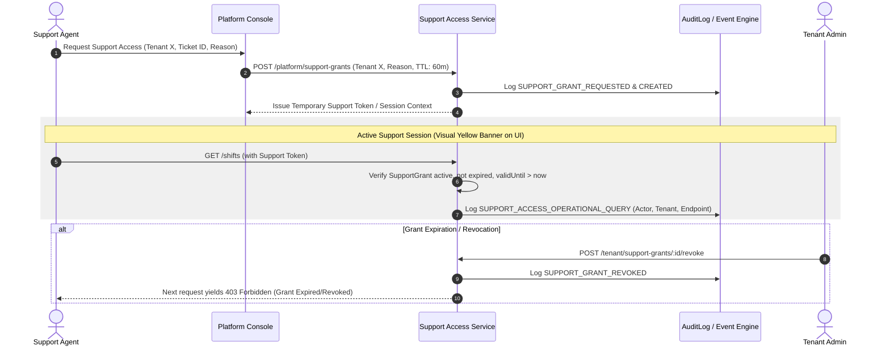

# ADR-032 — Platform Support Access Architecture Design

## 1. Executive Summary
ADR-032 requires that platform support access to tenant operational data must be explicit, time-bounded, audited, and revocable. Platform users (even `PLATFORM_SUPER_ADMIN` or `PLATFORM_SUPPORT`) must **never** receive silent, automatic, or un-audited access to tenant data without an active, explicit support grant.

---

## 2. Authorization Boundaries
- Platform Role assignments (`PLATFORM_SUPPORT`, `PLATFORM_SUPER_ADMIN`) grant access **ONLY** to platform management scope (`platform.*`).
- Tenant Membership (`TenantMembership`) establishes authority inside a specific tenant workspace.
- Support impersonation or tenant troubleshooting without a membership is **prohibited**. A support grant acts as a temporary, audited, time-bounded support membership bridge.

---

## 3. Entity Blueprint: PlatformTenantSupportGrant

```prisma
enum SupportGrantStatus {
  REQUESTED
  ACTIVE
  EXPIRED
  REVOKED
}

model PlatformTenantSupportGrant {
  id              String             @id @default(uuid())
  platformUserId  String
  platformUser    User               @relation("SupportGrantUser", fields: [platformUserId], references: [id], onDelete: Cascade)
  tenantId        String
  tenant          Tenant             @relation(fields: [tenantId], references: [id], onDelete: Cascade)
  
  reason          String             // Mandatory explanation or customer ticket ID (e.g. "TICKET-94812: Investigating punch-in GPS calculation discrepancy")
  ticketRef       String?
  
  status          SupportGrantStatus @default(ACTIVE)
  validFrom       DateTime           @default(now())
  validUntil      DateTime           // Hard max duration (e.g., 2 hours)
  
  grantedByUserId String
  grantedByUser   User               @relation("SupportGrantGrantor", fields: [grantedByUserId], references: [id], onDelete: Restrict)
  
  revokedAt       DateTime?
  revokedByUserId String?
  revokedByUser   User?              @relation("SupportGrantRevoker", fields: [revokedByUserId], references: [id], onDelete: SetNull)

  createdAt       DateTime           @default(now())

  @@index([platformUserId, tenantId, status])
  @@index([validUntil])
}
```

---

## 4. Lifecycle & Enforcement Protocol



---

## 5. Security Invariants
1. **Mandatory Reason & Ticket Reference**: A support grant cannot be created without a non-empty `reason` string and customer ticket reference.
2. **Hard Time Boundary**: Maximum grant duration is hard-capped at 4 hours. No perpetual support grants allowed.
3. **Tenant Visibility**: Active support grants are visible in tenant admin audit logs and security dashboards (`GET /tenant/security/support-access`).
4. **Instant Revocation**: Tenant Administrators can revoke any active support grant immediately with 1-click.
5. **Operational Audit Trail**: Every API request made under a support grant context emits a specialized audit log (`action: "SUPPORT_DATA_ACCESS"`).
